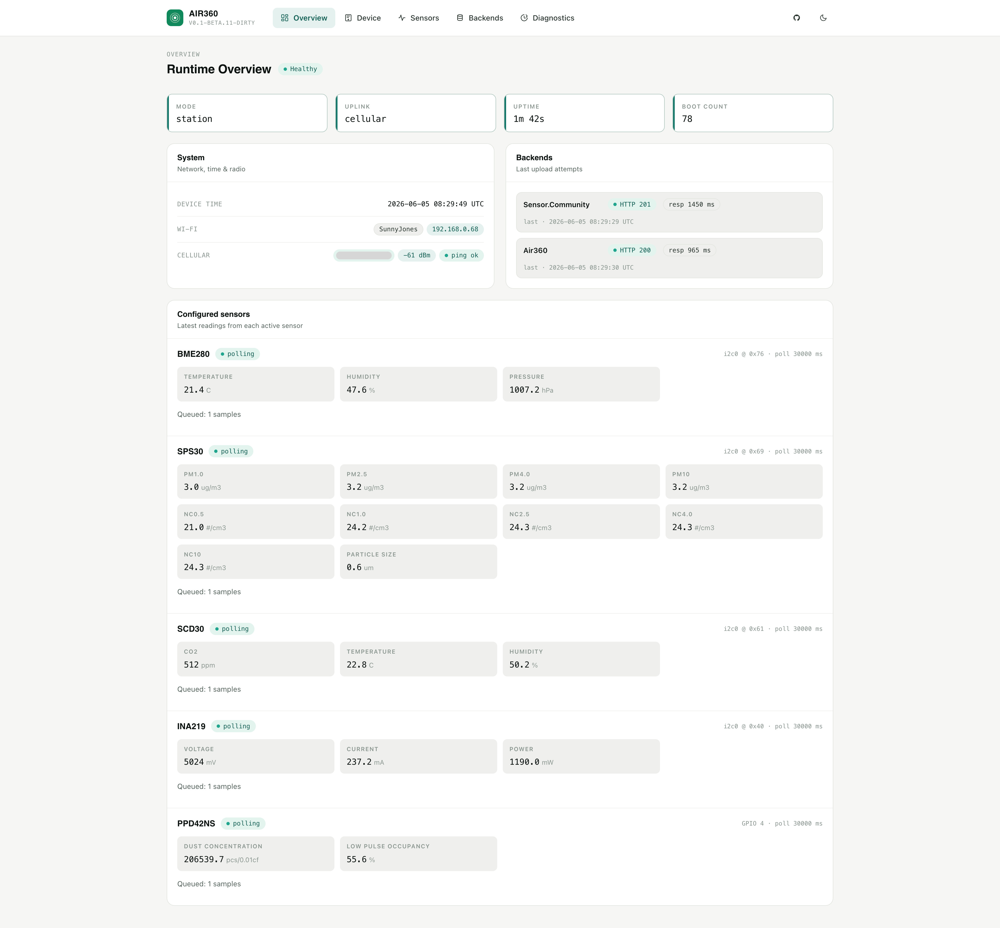
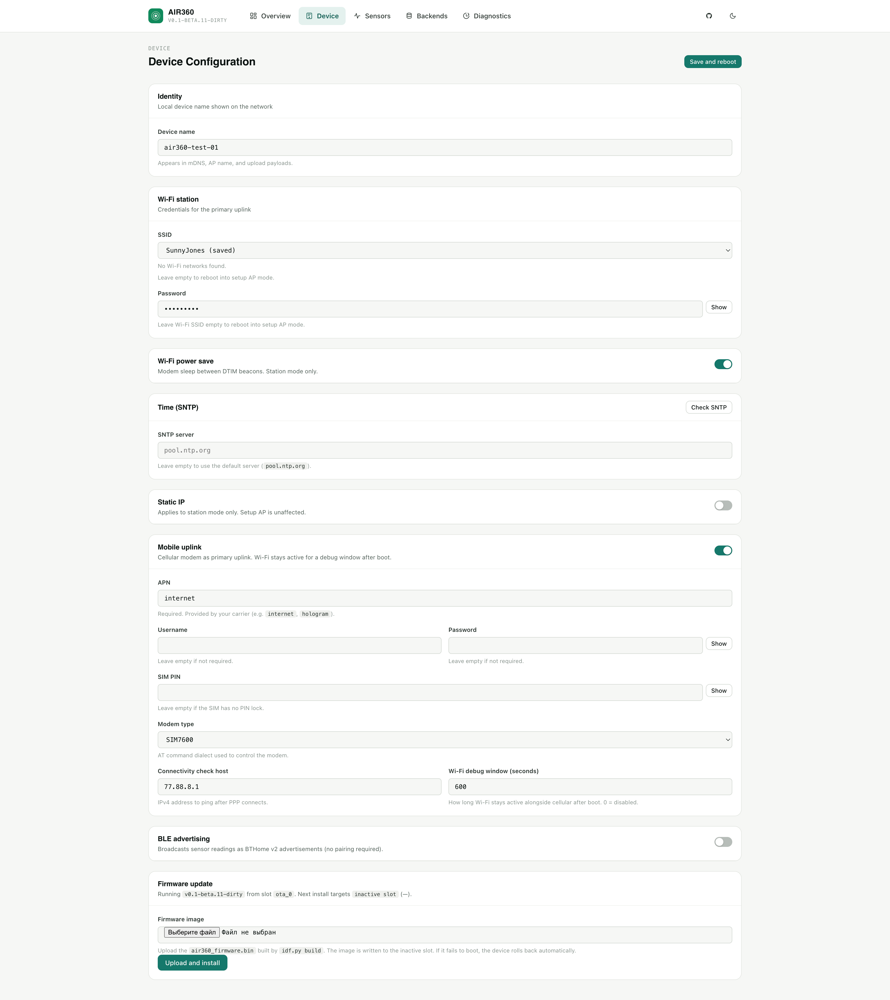
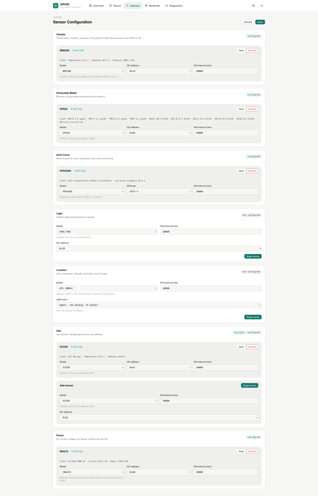
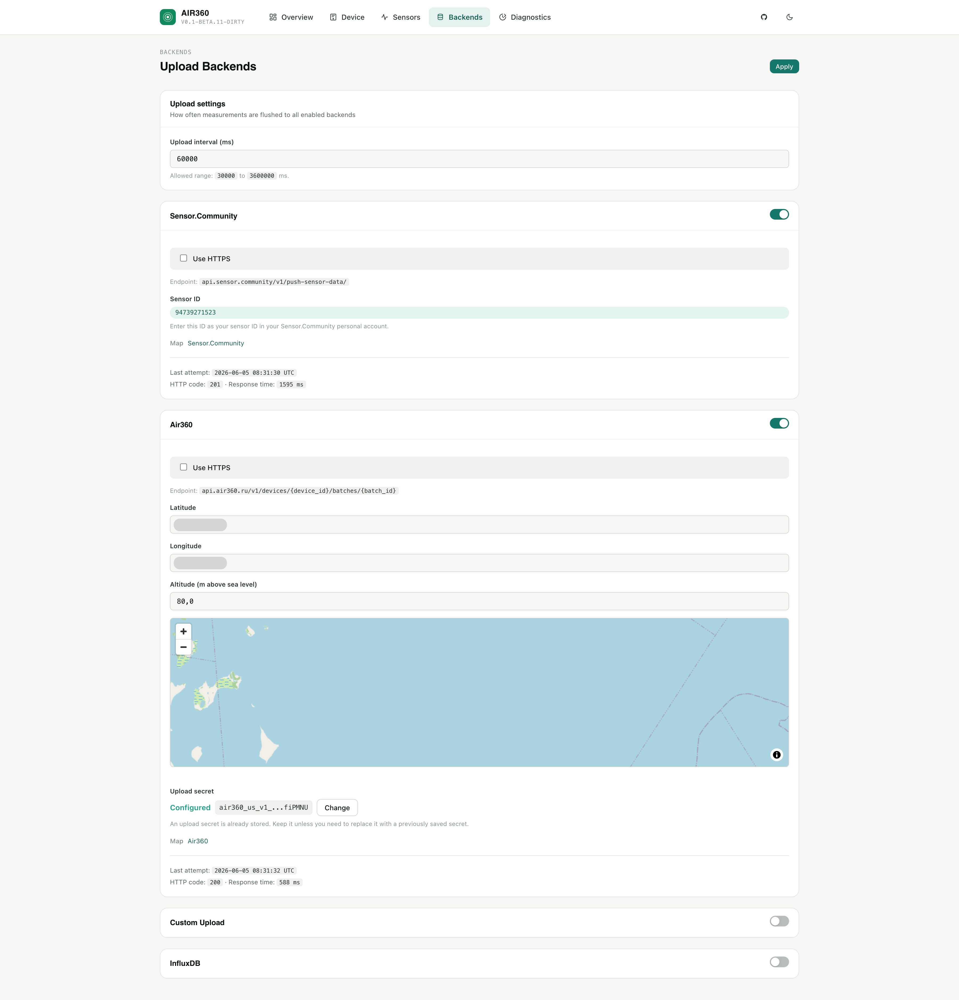
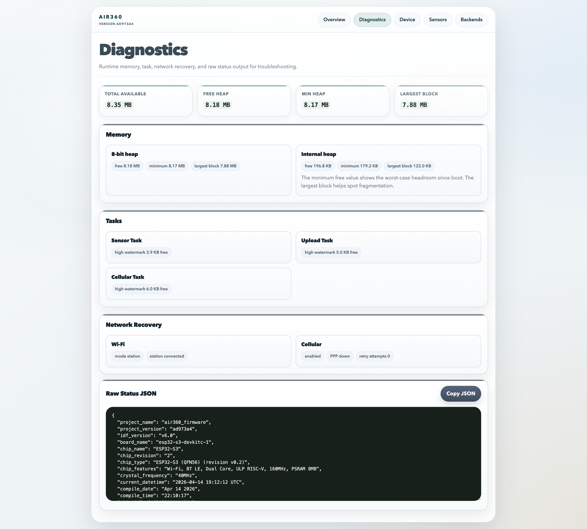

# Air360 Firmware User Guide

## Status

Implemented. Keep this guide aligned with the user-visible firmware behavior currently exposed by the device.

## Scope

This guide explains operational use of the device firmware from the perspective of a device user, not a firmware maintainer.

## Source of truth in code

- `firmware/main/src/web_server.cpp`
- `firmware/main/src/web_ui.cpp`
- `firmware/main/src/network_manager.cpp`
- `firmware/main/src/status_service.cpp`

## Read next

- [web-ui.md](web-ui.md)
- [configuration-reference.md](configuration-reference.md)
- [network-manager.md](network-manager.md)

This guide explains how to use the Air360 firmware web interface — from first boot through sensor and backend configuration in normal operation.

It is written for device users, not for firmware developers.

---

## What You Need

- A device flashed with the Air360 firmware
- A phone, tablet, or laptop with Wi-Fi
- The SSID and password of the Wi-Fi network the device should join

---

## Flashing The Firmware

If you are starting from a release package, the easiest path is the merged `full.bin` image via the browser-based ESP flash tool:

```
https://espflash.app/
```

Recommended flow:

1. Download the current `full.bin` release asset.
2. Open `https://espflash.app/` in a desktop browser with Web Serial support (Chrome or Edge).
3. Connect the device by USB.
4. Select the device serial port in the browser.
5. Select the Air360 `full.bin` file.
6. Start flashing and wait for the device to reboot.

After flashing, if no station Wi-Fi credentials are saved, the device boots into setup AP mode and exposes `http://192.168.4.1/config`.

---

## Network Modes

The firmware operates in one of two modes:

| Mode | When | Access |
|------|------|--------|
| `setup AP` | No valid station credentials, or station join failed | Connect to the device's own Wi-Fi network, open `http://192.168.4.1/` |
| `station` | Joined the configured Wi-Fi network | Open `http://{device-name}.local/` or the device's DHCP IP address |

In **setup AP mode** the navigation is intentionally limited to the `Device` page only. All other pages redirect to `Device`.

In **station mode** the full UI is available.

---

## Status LED

The board has a built-in RGB LED that shows the current device state:

| Color | Meaning |
|-------|---------|
| Blue | Booting |
| Green | Ready — joined your Wi-Fi network (station mode) |
| Pink | Ready — running in setup AP mode (no station credentials, or join failed) |
| Red | Fatal error — NVS failure or web server failed to start; check serial logs |

---

## First Boot: Setup AP Mode

When no Wi-Fi credentials are configured, the device starts in setup AP mode.

### Step 1 — Connect to the device AP

1. Power on the device.
2. Open Wi-Fi settings on your phone or laptop.
3. Connect to the Air360 setup network. The default SSID is `air360`, password `air360password`.

### Step 2 — Open the setup page

After connecting to the AP, most phones and laptops automatically show a "sign in to network" prompt and open the configuration page — no manual navigation required. If the prompt does not appear, open `http://192.168.4.1/` in a browser manually.

In setup AP mode both routes lead to the Device configuration page.

### Step 3 — Enter station Wi-Fi credentials

1. Optionally change the **Device name** (used as the DHCP hostname on your network).
2. In **Wi-Fi SSID**, pick a network from the scanned dropdown or type the SSID manually.
3. Enter **Wi-Fi password**.
4. Press **Save and reboot**.

The device reboots and attempts to join the configured network.

> To return to setup AP mode at any time, go to `Device`, clear the Wi-Fi SSID field, and save. The device will reboot into setup AP mode.

---

## Finding The Device In Station Mode

After a successful join, the device is reachable in two ways:

### By name (recommended)

Open `http://{device-name}.local/` in a browser on the same network.

The `{device-name}` part matches the **Device name** field you configured — lowercased and with spaces replaced by `-`. The default is `air360`, so the default address is:

```
http://air360.local/
```

mDNS is supported natively on macOS, iOS, Android, and most Linux systems. On Windows it requires the Bonjour service (installed automatically with iTunes, Apple devices, or some printer drivers). If `.local` does not resolve, use the IP address method below.

### By IP address

If mDNS does not work on your network:

- Check the connected client list in your router admin panel — look for the configured Device name as the DHCP hostname.
- Use a network scanner app on your phone.
- Check the serial monitor output during boot — the assigned IP is logged.

Then open `http://<device-ip>/` in a browser.

---

## Web UI Overview

The navigation bar contains five sections:

| Section | Purpose |
|---------|---------|
| **Overview** | Runtime dashboard: uplink state, connection details, sensors, backends |
| **Diagnostics** | Memory, task, recovery details, and raw status dump |
| **Device** | Network credentials, SNTP, static IP, and cellular modem settings |
| **Sensors** | Sensor inventory — add, configure, remove |
| **Backends** | Upload targets — enable, configure, monitor |

---

## Overview Page

The Overview page is the main runtime dashboard.



A **Health pill** (`Healthy` / `Unhealthy`) is shown inline under the page heading.

The stats bar shows four values:

| Field | Description |
|-------|-------------|
| Mode | Current network mode (`station` or `setup AP`) |
| Uplink | Active uplink: `wifi`, `cellular`, `cellular (connecting)`, or `offline`. Cellular is always the primary uplink when enabled. |
| Uptime | Time since last boot |
| Boot count | Total number of boots since first flash |

### Connection block

Shows the current network connection state:

- **Date** — current UTC date and time (from SNTP when synced).
- **Wi-Fi** — SSID and current IP address, or `not connected`.
- **Cellular** (shown only when cellular is enabled) — PPP IP address, signal strength in dBm, and ping status (`ping ok` / `ping failed`).

### Backend cards

Each enabled backend shows its current state, last upload attempt time, HTTP status code, and response time.

### Sensor cards

Each configured sensor shows:

- Sensor model and transport binding
- Configured poll interval
- Runtime state
- Queued sample count — how many collected measurements are currently waiting in the upload queue
- Latest readings
- Runtime error message, if any

---

## Device Page

The Device page manages network credentials, static IP, and cellular modem settings.



Available fields:

| Field | Description |
|-------|-------------|
| Device name | Logical name shown in the UI and used as the DHCP hostname |
| Wi-Fi SSID | Station network to join |
| Wi-Fi password | Station network password |
| SNTP server | NTP hostname; leave empty to use `pool.ntp.org` |
| Use static IP | When checked, the device uses the configured address instead of DHCP |
| IP / Mask / Gateway / DNS | Static IP parameters; pre-filled from current DHCP lease when not yet configured |
| Enable cellular uplink | Enables the SIM7600E modem as the primary uplink |
| APN | Carrier APN; pre-filled with `internet` when empty |
| Username / Password | Optional PAP credentials |
| SIM PIN | Optional SIM PIN; leave empty if the SIM has no lock |
| Connectivity check host | IPv4 address to ping after PPP connects; leave empty to skip |
| Wi-Fi debug window | Seconds Wi-Fi stays active alongside cellular after boot; `0` = disabled |

**Saving device settings reboots the device.**

This page is available in both setup AP mode and station mode.

### SNTP Server

Leave the **SNTP server** field empty to use the default (`pool.ntp.org`). To use a custom NTP server, enter the hostname and press **Check SNTP** to test reachability before saving. The check runs immediately without submitting the form.

### Static IP

By default the device uses DHCP. To assign a fixed address:

1. Make sure the device is connected to your network (so the current lease can be pre-filled).
2. Open **Device**.
3. Check **Use static IP** — the IP, mask, gateway, and DNS fields will be pre-filled from the current DHCP lease.
4. Adjust the values if needed.
5. Press **Save and reboot**.

To return to DHCP, uncheck **Use static IP** and save.

> Static IP applies to station mode only. The setup AP address (`192.168.4.1`) is fixed and unaffected.

### Cellular Uplink (SIM7600E)

When cellular is enabled it becomes the primary uplink — the device connects to the mobile network via PPP and sends all uploads and SNTP traffic through the modem. Wi-Fi station remains available for web UI access during a configurable debug window after boot, then stops automatically.

**To enable:**

1. Check **Enable cellular uplink (SIM7600E)**.
2. Enter the **APN** provided by your carrier (e.g. `internet`, `hologram`).
3. Enter **Username** and **Password** if your carrier requires PAP authentication. Leave empty otherwise.
4. Enter the **SIM PIN** if the SIM card has a PIN lock. Leave empty otherwise.
5. Optionally enter a **Connectivity check host** (an IPv4 address to ping after PPP connects — useful for verifying the session is working end-to-end). Leave empty to skip the check.
6. Set **Wi-Fi debug window** to the number of seconds Wi-Fi should stay up alongside cellular after boot. Set to `0` to disable Wi-Fi immediately when PPP is up.
7. Press **Save and reboot**.

**After reboot:**

- The modem initialises, registers on the network, and connects via PPP.
- The **Overview** page Uplink stat shows `cellular` (connected) or `cellular (connecting)` (still registering).
- The Connection block shows the PPP IP address, signal strength (RSSI in dBm), and ping result if a connectivity check host is configured.
- Uploads and SNTP proceed through the cellular link.

**Reconnect behaviour:** if the PPP session drops, the firmware reconnects automatically with table backoff (10 s, 30 s, 1 min, 2 min, 5 min, 10 min, then 15 min). PWRKEY is only used after at least 10 minutes of continuous failure and is capped at one cycle per hour; registration state `searching` keeps polling without PWRKEY escalation.

**To disable cellular**, uncheck **Enable cellular uplink** and save.

---

## Sensors Page

The Sensors page manages the sensor inventory. Sensors are organized into categories.



### Supported sensors by category

| Category | Models |
|----------|--------|
| Climate | BME280, BME680 |
| Temperature & Humidity | SHT4X, HTU2X, DHT11, DHT22 |
| Temperature | DS18B20 |
| CO2 | SCD30 |
| Light | VEML7700 |
| Particulate Matter | SPS30 |
| Location | GPS (NMEA) |
| Gas | ME3-NO2, MH-Z19B |
| Power Monitoring | INA219 |

All categories except **Gas** allow only one configured sensor at a time.

### Default transport bindings

| Sensor | Transport | Pins |
|--------|-----------|------|
| BME280 | I2C at 0x76 | SDA=GPIO8, SCL=GPIO9 |
| BME680 | I2C at 0x77 | SDA=GPIO8, SCL=GPIO9 |
| SHT4X | I2C at 0x44 | SDA=GPIO8, SCL=GPIO9 |
| HTU2X | I2C at 0x40 | SDA=GPIO8, SCL=GPIO9 |
| SCD30 | I2C at 0x61 | SDA=GPIO8, SCL=GPIO9 |
| VEML7700 | I2C at 0x10 | SDA=GPIO8, SCL=GPIO9 |
| SPS30 | I2C at 0x69 | SDA=GPIO8, SCL=GPIO9 |
| GPS (NMEA) | UART1 at 9600 baud (UART2 selectable) | UART1 RX=GPIO18/TX=GPIO17; UART2 RX=GPIO16/TX=GPIO15 |
| DHT11, DHT22 | GPIO | Descriptor-allowed pins: GPIO4, GPIO5, or GPIO6 |
| DS18B20 | GPIO (1-Wire) | Descriptor-allowed pins: GPIO4, GPIO5, or GPIO6 |
| ME3-NO2 | Analog (ADC) | Descriptor-allowed pins: GPIO4, GPIO5, or GPIO6 |
| INA219 | I2C at 0x40 | SDA=GPIO8, SCL=GPIO9 |
| MH-Z19B | UART2 at 9600 baud (UART1 selectable) | UART2 RX=GPIO16/TX=GPIO15; UART1 RX=GPIO18/TX=GPIO17 |

I2C sensors allow selecting one of the descriptor-supported addresses if your module uses a non-default address. UART sensors allow selecting one of the descriptor-supported UART ports; the UI shows the RX/TX pins for each port. GPIO and analog sensors require selecting one of the three available board pins.

### Cellular modem (SIM7600E)

The modem is not configured on the Sensors page — it is managed on the Device page. Its default pin assignment is listed here for reference when planning your wiring.

| Device | Transport | Pins |
|--------|-----------|------|
| SIM7600E | UART1 at 115200 baud | RX=GPIO18, TX=GPIO17, PWRKEY=GPIO12, SLEEP/DTR=GPIO21 |

> **Note:** GPS (NMEA) and the SIM7600E share the same default UART1 pins (GPIO17/18). They cannot be used at the same time on UART1. If you need both, move GPS to UART2 on the Sensor Configuration page or change the modem UART assignment.

### Adding a sensor

1. Open **Sensors**.
2. Find the category you want.
3. Select the sensor model.
4. Set the **Poll interval (ms)**. Minimum is 5000 ms for most sensors.
5. For I2C sensors: adjust the **I2C address** only if needed.
6. For GPIO or analog sensors: select the board pin from the dropdown.
7. Make sure the sensor is enabled.
8. Press **Stage sensor changes**.

### Removing or updating a sensor

1. Open the existing sensor card.
2. Change settings and press **Stage sensor changes**, or press **Stage sensor deletion**.

### Applying changes

Sensor edits are staged in memory and are not saved until you explicitly apply them:

- **Apply now** — persists the staged sensor list to NVS and rebuilds the sensor runtime without rebooting the device.
- **Discard pending changes** — discards all staged edits and returns to the last saved state.

After pressing **Apply now**, sensor readings should appear in **Overview** within the first configured poll interval.

---

## Backends Page

The Backends page configures where measurement data is uploaded.



### Upload interval

The **Upload interval** field at the top of the page controls how often the device sends a data batch to all enabled backends. The allowed range is 10 000–300 000 ms (10 s to 5 min). The default is 145 000 ms.

### Sensor.Community

To use Sensor.Community:

1. Open **Diagnostics** and find `short_device_id` in the raw status dump — this is the ID you register on the Sensor.Community portal.
2. Register your device at `https://devices.sensor.community/` using that Short ID.
3. Return to the firmware **Backends** page.
4. Enable Sensor.Community.
5. Leave **Device ID override** at its default value unless you need a different ID for debugging.
6. Press **Save**.

> The ID registered on the Sensor.Community portal must match the ID the firmware sends. By default this is the `short_device_id` from the Diagnostics page raw status dump. If you fill in the Device ID override field, that value is used instead and must match the portal registration.

### Air360 API

Enable Air360 API and press **Save**. No additional credentials are required in the current firmware version.

### Custom Upload

Use this backend when you want to send the same Air360 JSON body to your own HTTP endpoint:

1. Open **Backends**.
2. Enable **Custom Upload**.
3. Set **Use HTTPS** as needed.
4. Fill in **Host**, **Path**, and **Port**.
5. Press **Save**.

The firmware sends a single `POST` request per upload cycle with the same JSON body shape as `Air360 API`.

### InfluxDB

Use this backend when you want the firmware to write sensor samples as Influx line protocol:

1. Open **Backends**.
2. Enable **InfluxDB**.
3. Set **Use HTTPS** as needed.
4. Fill in **Host**, **Path**, **Port**, and **Measurement**.
5. Optionally fill in **User** and **Password** for Basic Auth.
6. Press **Save**.

The firmware sends one POST per upload cycle. The body contains multiple line protocol rows, one row per grouped sensor sample.

### Save behavior

Backend settings are saved immediately when you press **Save** — there is no staged apply flow for backends.

### Backend runtime status

Each backend card shows:

- Enabled or disabled state
- Endpoint
- Last upload attempt time
- HTTP status code
- Response time in ms
- Last error, if any

---

## Diagnostics

The Diagnostics page includes a formatted raw runtime JSON dump at the bottom:

This page is useful for advanced troubleshooting. The raw dump includes build information, boot count, reset reason, network state, sensor runtime state with latest measurements and queued sample counts, and backend runtime state.

The JSON also includes a top-level `diagnostics` object with heap totals, heap headroom, largest free block, task stack high watermarks, and measurement queue counters. The `cellular` object includes reconnect attempts, consecutive setup failures, `pwrkey_cycles_total`, and `last_pwrkey_ms_ago` for modem escalation diagnostics.

### Diagnostics page



Open:

```
http://<device-ip>/diagnostics
```

This page summarizes the same troubleshooting-oriented runtime metrics in human-readable form:

- total available 8-bit heap
- current and minimum free heap
- largest free heap block
- internal heap headroom
- task stack high watermarks
- current Wi-Fi and cellular error state

The page also has a **Copy JSON** button next to the raw dump, so the formatted diagnostics payload can be copied without manual selection in browsers that support clipboard access.

### Memory metrics

The memory stats at the top of Diagnostics are meant to answer different questions:

- **Total Available**: total 8-bit heap currently available to the allocator
- **Free Heap**: total free 8-bit heap right now
- **Min Heap**: the lowest free 8-bit heap value seen since boot
- **Largest Block**: the largest single contiguous block that can be allocated right now

If `Free Heap` is high but `Largest Block` is much smaller, that usually means fragmentation rather than simple low-memory pressure.

If the board boots with PSRAM enabled and detected, the **8-bit heap** values should be larger than the **Internal heap** values. If they are identical, the device is effectively running without PSRAM-backed heap.

---

## Time Synchronization And Upload Timing

Uploads require valid UTC time. The firmware synchronizes time via SNTP after the uplink is ready — either the Wi-Fi station connection or the cellular PPP session.

What this means in practice:

- It is normal for uploads to not start immediately when the web UI first becomes reachable.
- The **Overview** Connection block shows the current UTC date once time is synchronized. Before sync the date shows `1970-01-01`.
- The **Health** pill turns `Healthy` once time sync and other checks pass.
- The firmware retries SNTP continuously while the uplink is active.
- SNTP works over both Wi-Fi and cellular — no separate configuration is needed for cellular.

---

## Typical Workflows

### First-time setup

1. Power on the device.
2. Connect to the `air360` setup AP (password: `air360password`).
3. Open `http://192.168.4.1/`.
4. Enter station Wi-Fi SSID and password.
5. Press **Save and reboot**.
6. Once the LED turns green, open `http://air360.local/` (or the IP from your router if `.local` does not resolve).

### Configuring sensors

1. Open **Sensors**.
2. Add each sensor you have physically connected to the device.
3. Stage the changes.
4. Press **Apply now**.
5. Check **Overview** to confirm sensors show readings within the first poll interval.

### Enabling Sensor.Community upload

1. Open **Diagnostics** → find `short_device_id` in the raw status dump.
2. Register the device at `https://devices.sensor.community/`.
3. Open **Backends** → enable Sensor.Community → press **Save**.
4. Set the upload interval as needed.
5. Monitor upload status on **Overview** or **Backends**.

### Enabling custom HTTP upload

1. Open **Backends**.
2. Enable **Custom Upload**.
3. Set **Use HTTPS** as needed.
4. Fill in **Host**, **Path**, and **Port**.
5. Press **Save**.
6. Monitor upload status on **Overview** or **Backends**.

### Assigning a static IP

1. Connect the device to your network (DHCP must give it an address first).
2. Open **Device** → check **Use static IP**.
3. The IP, mask, gateway, and DNS fields are pre-filled from the current lease — adjust if needed.
4. Press **Save and reboot**.

### Setting up cellular

1. Insert a SIM card and connect the SIM7600E modem.
2. Open **Device** → check **Enable cellular uplink**.
3. Enter APN (and credentials if required by your carrier).
4. Optionally enter a connectivity check host (e.g. `8.8.8.8`).
5. Set **Wi-Fi debug window** to how long you want Wi-Fi to stay active after boot for web UI access.
6. Press **Save and reboot**.
7. Watch the **Uplink** stat on **Overview** — it will change from `cellular (connecting)` to `cellular` once the PPP session is up.

---

## Troubleshooting

### The device stays in AP mode after reboot

- Wi-Fi SSID or password is incorrect.
- The configured Wi-Fi network is out of range or unavailable.

**Fix:** Reconnect to the setup AP, open `/config`, correct the credentials, and save again.

### The UI opens but uploads do not start

Check:
- The mode shown on **Overview** is `station`, not `setup AP`.
- The current UTC date on **Overview** is valid, not `1970` — time sync must succeed first.
- Sensor cards show actual readings.
- Backend cards do not show transport or HTTP errors.

### A sensor shows no data or an error

Check:
- The sensor is enabled.
- Physical wiring matches the configured transport (correct I2C address or GPIO pin).
- The runtime state and error message on the sensor card in **Overview**.
- For I2C sensors: confirm the sensor is powered and properly connected to SDA/SCL.

### The sensor queue count keeps growing

If the queued sample count on a sensor card keeps increasing without going down:

- Backend uploads are likely failing — check backend cards for errors.
- The device may have lost station uplink.
- UTC time may not be synchronized — check the date on **Overview**.

### Moving the device to a different Wi-Fi network

Open **Device**, update the SSID and password, and press **Save and reboot**. The device will attempt to join the new network.

### Cellular Uplink stat stays at `cellular (connecting)`

The modem is not reaching the network. Check:

- SIM card is inserted correctly and the carrier has signal at the device location.
- APN is correct for your carrier.
- SIM PIN is configured if the SIM has a PIN lock.
- PAP username/password are correct if your carrier requires them.
- Serial monitor logs from the modem task (`air360.cellular`) may show the exact failure reason.

The firmware retries automatically with backoff. If the modem reports "searching", it keeps polling without PWRKEY cycling. PWRKEY is only used after a long continuous failure window and is rate-limited, so you normally do not need to reboot the device manually.

### Cellular connected but uploads are not going through

Check:

- The connectivity check result in the Connection block (`ping ok` / `ping failed`). A failed ping means PPP is up but there is no working route — verify APN and carrier data plan.
- Backend cards show the last HTTP status code and error — check for DNS or connection errors.
- UTC date on **Overview** must not show `1970` — SNTP must sync before uploads start.

---

## Current Limitations

- Device name, network, and cellular changes require a reboot.
- Sensor changes require explicitly pressing **Apply now** — staging alone does not persist.
- Setup AP mode exposes only the Device page.
- The upload interval is global — it applies to all enabled backends.
- Sensor poll interval cannot be set below 5000 ms (2000 ms for DHT11/DHT22).
- When cellular is enabled, the web UI is only accessible during the Wi-Fi debug window after boot. Set the debug window to a non-zero value to retain web access for configuration.
- The `storage` partition is reserved but not currently used.
- OTA firmware update is not yet implemented.
