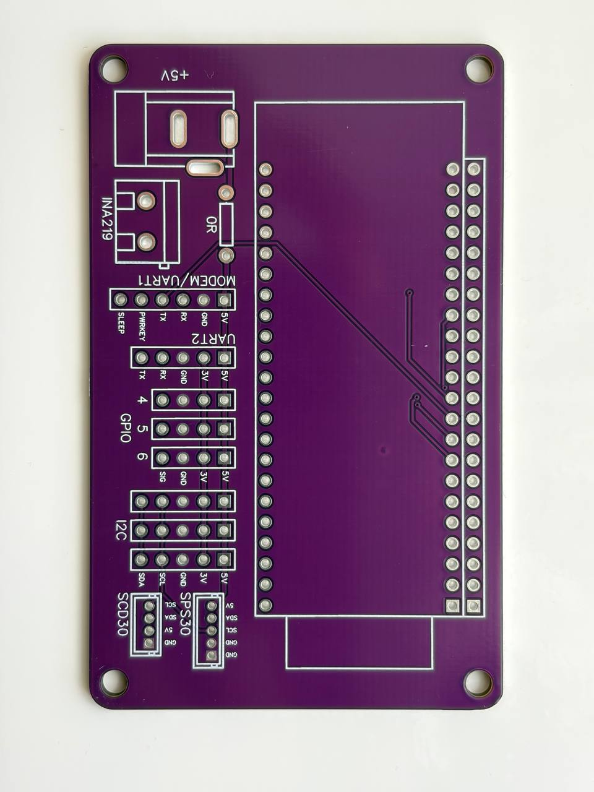
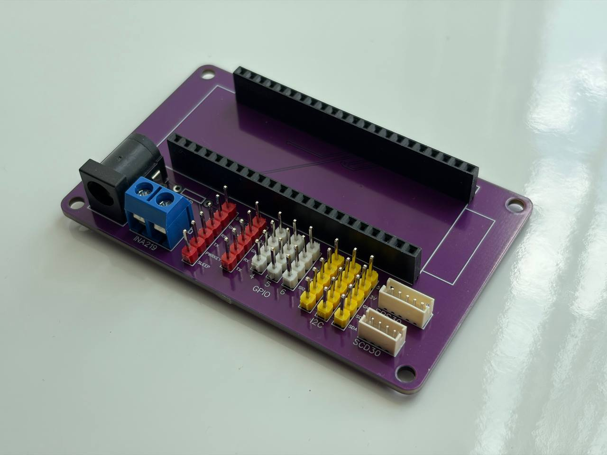
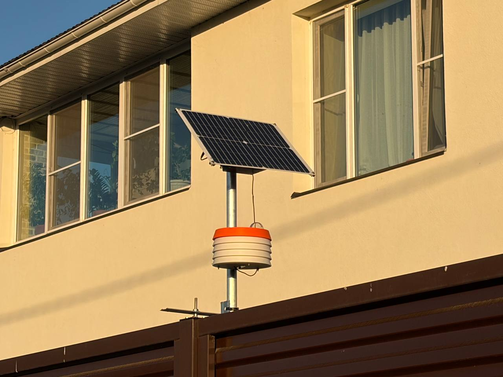

# Air360 Build Guide — Hardware Assembly

This guide covers the physical build: assembling the device, wiring sensors,
choosing an enclosure, and powering the unit. Once the hardware is ready,
continue with [Firmware, Web Interface, and Backends](firmware-and-backends.md).

---

## Two ways to build Air360

You can assemble the device with the **Air360 shield board** or **wire sensors
directly** to the ESP32-S3. The shield reduces wiring mistakes and is the
recommended path for repeatable builds; direct wiring is useful for prototypes,
debugging, and custom enclosures.

| Option | Best for | Notes |
|--------|----------|-------|
| **Shield board** (recommended) | Repeatable, reliable builds | Power and signal lines break out to labeled connectors. |
| **Direct wiring** | Prototypes, debugging, custom enclosures | Requires careful power, ground, and shared-bus wiring. |

---

## Option 1: Build with the shield board

The shield sits on top of the ESP32-S3 and breaks power, I2C, UART, and
auxiliary lines out to connectors. This is the primary user path for repeatable
builds.

- Order the board from the Gerber files or from the OSHWLab project.
- Check the board revision against this guide before soldering.
- After assembly, sensors connect to the labeled shield connectors.

**Board sources:**

- [Download Gerber files](https://github.com/serber/air360/raw/refs/heads/main/docs/hardware/Gerber_Air360-Shield_PCB_Air360_2026-06-05.zip)
- [Open the OSHWLab project](https://oshwlab.com/serber2006/air360)

### Baseline parts

These are the baseline components needed to assemble the shield board.

| Component | Qty | Use | Search keywords |
|-----------|-----|-----|-----------------|
| DS1023-1x22S21, 1x22 female socket header, 2.54 mm pitch | 2 pcs | Headers for mounting the shield onto the ESP32-S3. | `DS1023-1x22S21 female header 2.54mm` |
| Single row male 2.54 mm breakable pin header | 1 strip or as needed | Male pin headers for auxiliary pins and jumpers. | `2.54mm single row breakable male pin header` |
| DC-005, 5.5×2.1 mm PCB-mount DC barrel jack | 1 pc | DC power input on the shield board. | `DC-005 5.5x2.1mm PCB mount DC power jack` |
| JST ZH 1.5 mm, 4-pin / 5-pin connector set | as needed | Optional cable connectors for SPS30 and SCD30. | `JST ZH 1.5mm 4 pin 5 pin connector housing crimp terminal` |
| KF301-5.0-2P, 2-pin 5.0 mm screw terminal block | 1 pc if INA219 is used | Screw terminal for the INA219 power measurement path. | `KF301-5.0-2P 2 pin 5.0mm screw terminal block` |
| 0 Ω resistor / 0R jumper | 1 pc if INA219 is not used | Jumper in place of the INA219 path when current sensing is not installed. | `0 ohm resistor 0R jumper` |

---

## Option 2: Wire directly to the ESP32-S3

Connect sensors to GPIOs directly using the table below. This path requires
careful attention to power, ground, and shared-bus wiring. The values follow the
current firmware defaults; some UART and GPIO sensors can be reassigned later in
the device web UI, but these are the best starting point for a first build.

- **I2C:** all I2C sensors share `SDA=GPIO8` and `SCL=GPIO9`.
- **GPIO and analog sensors:** use one of `GPIO4`, `GPIO5`, or `GPIO6`.
- For multiple I2C devices, use a branched I2C bus or a dedicated hub (search
  "I2C hub" on AliExpress, Amazon, or similar marketplaces).
- All signal lines must be compatible with ESP32-S3 3.3 V logic.
- UART1 is shared by GPS and the cellular modem by default — use separate UART
  ports if both are installed.

| Sensor(s) | Interface | ESP32-S3 pins | Note |
|-----------|-----------|---------------|------|
| AHT30, BME280, BME680, BMP390, SHT3X, SHT4X, HTU2X, SCD30, SCD40, SCD41, VEML7700, OPT3001, SPS30, INA219 | I2C | `SDA=GPIO8`, `SCL=GPIO9` | Use one shared I2C bus for multiple modules; sensor addresses must not conflict. |
| SDS011, PMSX003, MH-Z19B | UART2 by default, 9600 baud | `RX=GPIO16`, `TX=GPIO15`; UART1 `RX=GPIO18`, `TX=GPIO17` is selectable | Sensor TX goes to ESP32-S3 RX; sensor RX goes to ESP32-S3 TX. |
| GPS (NMEA) | UART1 by default, 9600 baud | `RX=GPIO18`, `TX=GPIO17`; UART2 `RX=GPIO16`, `TX=GPIO15` is selectable | UART1 conflicts with the SIM7600E default pins. |
| DHT11, DHT22, DS18B20 | GPIO | `GPIO4`, `GPIO5`, or `GPIO6` | Select one available pin in the sensor settings. |
| PPD42NS | GPIO | P1/yellow signal to `GPIO4` by default; `GPIO5` or `GPIO6` selectable | Requires 3.3 V-safe signal level shifting. |
| SIM7600E / cellular modem | UART1, 115200 baud | `RX=GPIO18`, `TX=GPIO17`, `PWRKEY=GPIO12`, `SLEEP/DTR=GPIO21` | RESET is not wired by default; do not use GPS on UART1 at the same time. |

---

## Choose your sensors

Pick one or more sensors based on what you want to monitor. Sensors can be
combined freely; values go to the Air360 API, and compatible values also go to
Sensor.Community.

### Climate

| Sensor | Measures | Why you'd want it |
|--------|----------|-------------------|
| BME280 | Temperature, humidity, pressure | Compact all-in-one climate sensor; good for indoor and outdoor baseline monitoring. |
| BME680 | Temperature, humidity, pressure, gas resistance (VOC) | Same as BME280 with a gas sensor that estimates indoor air quality and VOCs. |
| BMP390 | Pressure, temperature | Precise barometer (no humidity). Choose it when pressure accuracy matters most. |
| AHT30 | Temperature, humidity | Accurate and low-cost; a reliable I2C upgrade over DHT22. |
| SHT3X | Temperature, humidity | High-accuracy sensor; more consistent than AHT30 across wide temperature ranges. |
| SHT4X | Temperature, humidity | Improved successor to SHT3X with higher accuracy in humid environments. |
| HTU2X | Temperature, humidity | Budget option; lower accuracy than the SHT series but widely available. |
| DHT11 | Temperature, humidity | Entry-level, limited range (0–50 °C, 20–90 %RH); suitable for learning or quick tests. |
| DHT22 | Temperature, humidity | Better range and accuracy than DHT11; common first sensor for prototypes. |
| DS18B20 | Temperature | Waterproof probe; designed for outdoor, soil, or liquid temperature measurement. |

### Particulate matter

| Sensor | Measures | Why you'd want it |
|--------|----------|-------------------|
| SPS30 | PM1.0, PM2.5, PM4.0, PM10, particle count, typical particle size | Most complete PM sensor in the lineup; recommended for outdoor air quality stations. |
| SDS011 | PM2.5, PM10 | Affordable laser sensor; popular for city and roadside air monitoring. |
| PMSX003 (PMS5003 / PMS7003) | PM1.0, PM2.5, PM10, particle count bins | Widely available compact sensor; good balance of cost and data completeness. |
| PPD42NS | Particle count (coarse) | Basic optical sensor; lower accuracy; GPIO-based, no shared bus required. |

### CO₂ and gas

| Sensor | Measures | Why you'd want it |
|--------|----------|-------------------|
| SCD30 | CO₂, temperature, humidity | NDIR CO₂ sensor; accurate and stable; recommended for ventilation and indoor air quality. |
| SCD40 | CO₂, temperature, humidity | Compact photoacoustic CO₂ sensor; lower cost and smaller footprint than SCD30. |
| SCD41 | CO₂, temperature, humidity | Higher-accuracy variant of SCD40 with single-shot measurement support (not used by this firmware); good when board space is tight. |
| MH-Z19B | CO₂ | NDIR CO₂ via UART; compact and common for home automation projects. |

### Light

| Sensor | Measures | Why you'd want it |
|--------|----------|-------------------|
| VEML7700 | Illuminance (lux) | Measures ambient light level; useful for daylight tracking or light-dependent control. |
| OPT3001 | Illuminance (lux) | Alternative to VEML7700 with a slightly different spectral response; same use cases. |

### Power monitoring

| Sensor | Measures | Why you'd want it |
|--------|----------|-------------------|
| INA219 | DC current, voltage, power | Monitors the device's own power consumption; useful for solar-powered or battery-backed setups. |

### GPS — location tagging

A GPS module (any NMEA-compatible receiver via UART) adds geographic coordinates
to every measurement batch. Use it for fixed outdoor stations where you want
precise coordinates attached to each reading, or for mobile setups mounted on a
vehicle or carried as a portable unit.

### Cellular modem — connectivity without Wi-Fi

A cellular modem lets the device upload data over a SIM card with no Wi-Fi
required. Supported models: SIM7600 (default), SIM7070, SIM7000, BG96, EC20,
SIM800, and Generic (any AT-command modem via esp-modem). This is the right
choice for rooftop stations, remote field installations, or any location where a
stable Wi-Fi connection is not available.

---

## Enclosure: Stevenson screen

For outdoor installation, you can 3D-print a Stevenson-screen-style enclosure.
It shields the device from direct sun and rain while keeping airflow around the
sensors.

- [Open the model on Printables](https://www.printables.com/model/1743061-air360-stevenson-screen-enclosure)

---

## Powering the device

Air360 runs on 5 V. Choose whichever supply suits your installation.

### Option 1: Mains power (5 V adapter)

Connect any 5 V USB power adapter. Two connection points are available depending
on your build:

- Via the **USB-C port** on the ESP32-S3 — works for both direct-wiring and
  shield builds.
- Via the **DC-005 barrel jack** (5.5 × 2.1 mm) on the shield board.

### Option 2: Solar panel with MPPT charger

For off-grid and outdoor deployments. The setup uses a custom MPPT module based
on the **CN3722** that charges a battery from a solar panel and powers the
device via power-path switching — the device stays on at night and on overcast
days.

- The reference build — 2S LiFePO4 battery, 1 A charge current, on-board NTC —
  has its own page with a full BOM:
  [Solar Power Module (CN3722)](solar-power-module.md).
- For a different battery chemistry or cell count, read the full CN3722 article
  before sourcing components — several values depend on the battery.
- 3D-printable solar panel mount and MPPT module enclosure are on Printables;
  assembly instructions and a link to the PCB are on the same page.

Links:

- [Solar Power Module (CN3722) build guide](solar-power-module.md)
- [Solar mount on Printables](https://www.printables.com/model/1490965-solar-panel-mount)
- [CN3722 MPPT article](https://www.maltepoeggel.de/?site=solar-mppt-cn3722)

---

*Next: [Firmware, Web Interface, and Backends](firmware-and-backends.md).*
