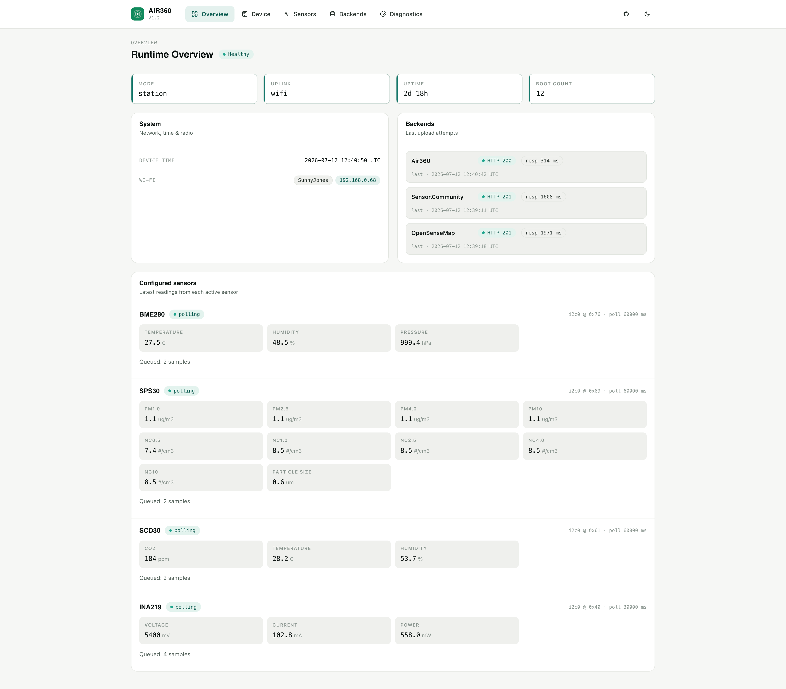
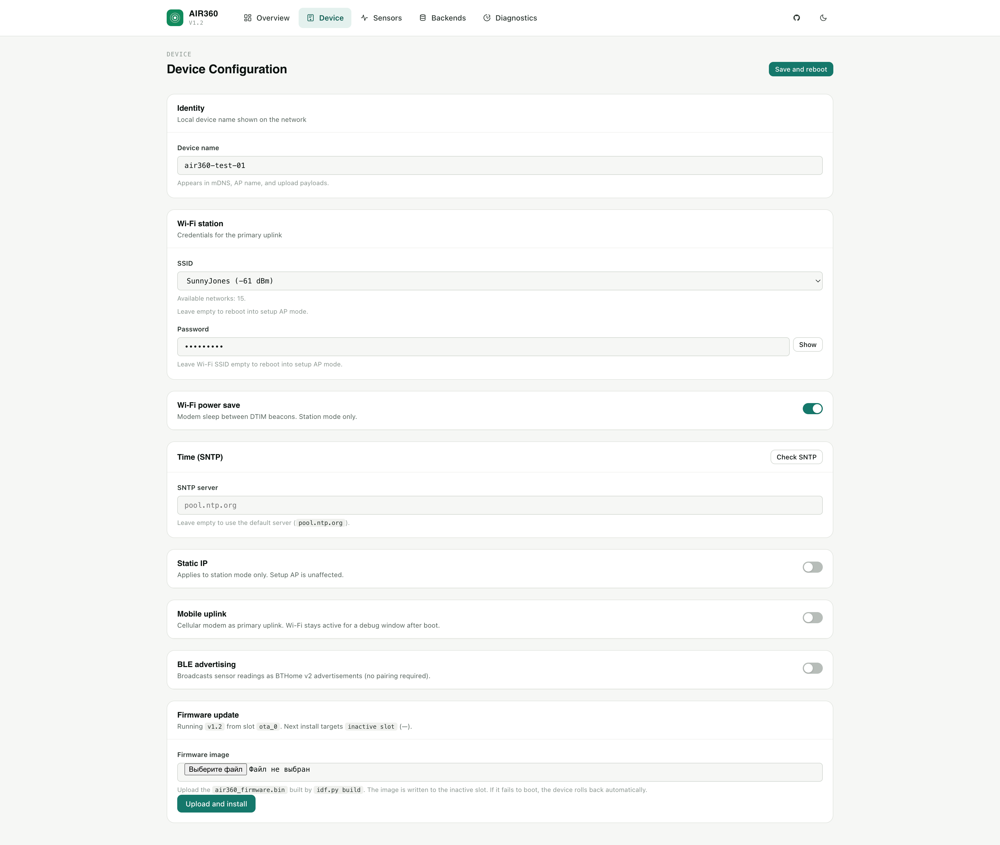
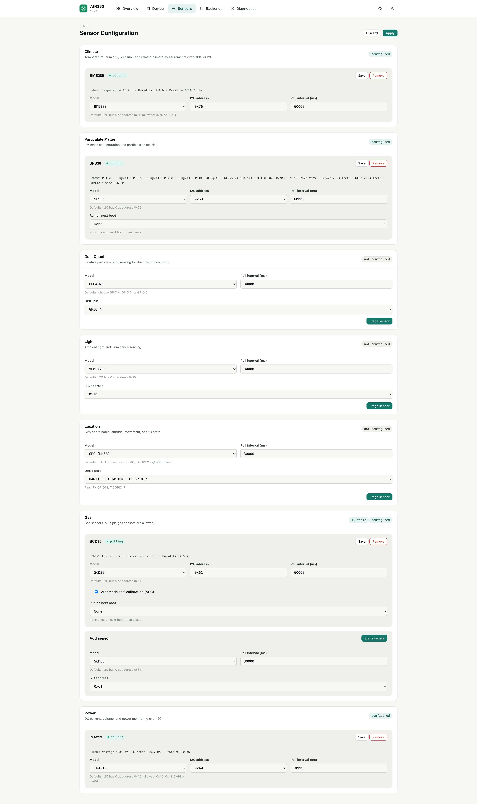
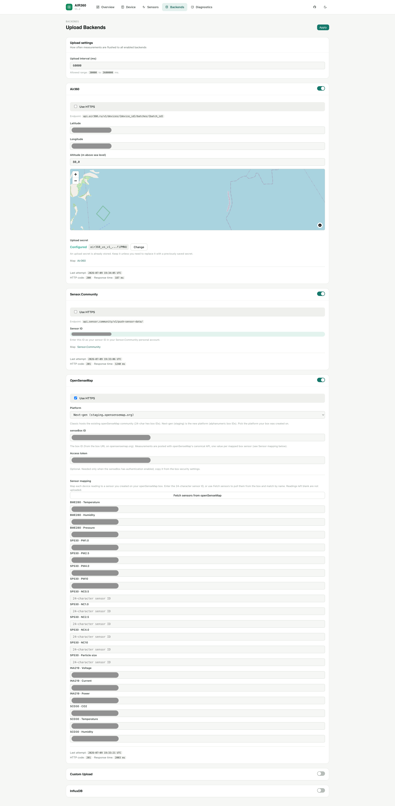

# Air360 Build Guide — Firmware, Web Interface, and Backends

This guide covers what to do once the hardware is assembled: flashing the
firmware, using the device web interface, and choosing where measurements are
sent. For the physical build, see [Hardware Assembly](assembly.md).

---

## Flashing the device

The easiest way to start is to flash the ready-made merged `full.bin` image with
the browser-based ESP Flash tool. After first boot, the device starts a Wi-Fi
setup access point.

- [Open Air360 releases](https://github.com/serber/air360/releases)
- [Open ESP Flash](https://espflash.app/)

### Steps

1. **Download `full.bin`** — open Air360 releases and download the current
   `full.bin`. This is the complete merged image for first-time flashing.
2. **Flash via USB** — open [espflash.app](https://espflash.app/), connect the
   ESP32-S3 by USB, select the serial port and the `full.bin` file, then start
   flashing. Wait for the process to finish.
3. **First boot — setup AP** — the device reboots. The LED turns **pink** — it
   is in setup AP mode. Connect your phone or laptop to the `air360` Wi-Fi
   network (password: `air360password`).
4. **Configure Wi-Fi** — a setup page opens automatically after connecting to
   the AP. Select your Wi-Fi network from the list, enter the password, and tap
   Save.
5. **Verify connection** — the device reboots and joins your network. **Green
   LED** = connected. **Pink LED** = connection failed — check the password and
   try again.
6. **Open the device** — go to `http://air360.local` or `http://192.168.4.1` in
   your browser to configure sensors and upload backends.

### Access reference

| What | Value | Note |
|------|-------|------|
| Setup Wi-Fi | `air360` | Access point name after a clean flash. |
| AP password | `air360password` | Default setup access point password. |
| Device URL | `http://air360.local/` or `http://192.168.4.1/` | Open the device web interface by hostname or by IP address. |

### LED indicator reference

| Color | Meaning |
|-------|---------|
| Blue | Booting. |
| Pink | Setup AP mode — no Wi-Fi configured, or connection to Wi-Fi failed. |
| Green | Connected to Wi-Fi (station mode). |
| Red | Fatal boot error — check serial logs. |

---

## Device web interface

After the device joins your Wi-Fi network, open `http://air360.local` or the
device IP in a browser. The interface has four sections.

### Overview

A read-only dashboard showing device health, network mode, IP address, uptime,
and current time. Sensor readings and backend upload results — last status and
upload time — are listed here. This is the first page to check when something
does not look right.

### Device

Network and device settings: Wi-Fi credentials, device name, static IP, cellular
modem (APN, modem type, credentials), BLE advertising, and Wi-Fi power save. The
firmware update card at the bottom of this page lets you upload a new `.bin` file
directly from the browser without USB access.

### Sensors

Add, configure, and remove sensors. For each sensor you choose the model, poll
interval, and connection (I2C address, UART port, or GPIO pin). Current state and
latest readings are shown on the sensor card. In most cases changes apply
immediately without a reboot.

### Backends

Configure where measurements are uploaded: Air360, Sensor.Community,
openSenseMap, InfluxDB, or Custom Upload. Each service is enabled or disabled
independently. The same page sets the upload interval and shows the last upload
result for every service.

- **Sensor.Community:** the device's Sensor ID is shown on this page. Register it
  at [devices.sensor.community/sensors](https://devices.sensor.community/sensors)
  to link the device to your Sensor.Community account and start seeing
  measurements on the map.
- **Air360 API:** `air360.ru` does not require registration. The device
  authenticates with an Upload secret — generate it on first setup and save it
  somewhere safe. If you reflash the device, reuse the same secret so your
  measurement history stays linked to the device.
- **Air360 API:** device coordinates are required before uploads begin. Use the
  map picker or enter latitude and longitude manually. Adding altitude above sea
  level is optional but recommended — it improves atmospheric pressure accuracy
  for stations at elevation.

---

## Where your measurements go

The device can send the same measurements to several services at once. Turn on
the ones you want in the device web interface: each service has its own upload
interval, and if one of them is temporarily unavailable, the others keep working.

### Air360 (our service)

The project's own service. It accepts readings from every sensor, and your
station shows up on the Air360 map right away.

- No account required: during setup the device creates a secret key. Save it —
  if you reflash the device, the same key keeps your measurement history.
- Set the device coordinates before uploads start. Altitude above sea level is
  optional, but it makes pressure readings more accurate.
- [Air360 map](https://air360.ru/map)

### Sensor.Community

A worldwide network of volunteer air quality stations. Your readings join a
public map that anyone can use.

- Works with BME280, BME680, BMP390, DHT11/22, HTU2X, SHT3X, SHT4X, DS18B20,
  SCD30, GPS, SPS30, SDS011 and PMSX003. Readings from other sensors are not
  sent.
- Register the sensor number that the device shows you, and your station will
  appear on their map.
- [sensor.community](https://sensor.community/) ·
  [Register a sensor](https://devices.sensor.community/sensors)

### openSenseMap

An open platform for environmental data. There is no fixed list of measurements:
you choose what your station publishes.

- You can publish anything you add to your senseBox, including CO₂, light level
  and GPS coordinates.
- The device fetches the sensor list from your senseBox and fills in the settings
  for you, so there is nothing to match up by hand.
- [opensensemap.org](https://opensensemap.org/)

### InfluxDB (your own server)

A database for time-series data. Pick it if you want to keep the readings on your
own machine and build charts in Grafana.

- You provide the server address; a login and password are optional.
- Readings from every sensor are sent, with nothing left out.
- [influxdata.com](https://www.influxdata.com/)

### Custom Upload (your own server)

Sends the same data to any address you enter, so you can collect the readings on
a server of your own.

- No login is added: protect the address yourself.
- Readings from every sensor are sent, with nothing left out.
- [Data format](https://github.com/serber/air360/blob/main/docs/firmware/upload-adapters.md)

---

## Sensor.Community compatibility

Air360 firmware keeps backward compatibility with Sensor.Community: the device
can still upload to the legacy Sensor.Community endpoint using the same short
device ID registered on `devices.sensor.community`. The Air360 API is broader and
accepts every current sensor type.

| Sensor / group | Sensor.Community | Air360 API |
|----------------|------------------|------------|
| BME280, BME680 | Yes: temperature, humidity, pressure; gas resistance is skipped | Yes: all sensor values in a typed JSON batch |
| BMP390 | Yes: temperature and pressure | Yes |
| DHT11, DHT22, HTU2X, SHT3X, SHT4X | Yes: temperature and humidity | Yes: all sensor values |
| DS18B20 | Yes: temperature | Yes |
| SCD30 | Yes: temperature, humidity, CO₂ | Yes |
| SPS30 | Yes: PM1.0, PM2.5, PM4.0, PM10, number concentration bins, typical particle size | Yes |
| SDS011 | Yes: PM2.5 and PM10 | Yes |
| PMSX003 | Partial: PM1.0, PM2.5, PM10; particle-count bins are skipped | Yes: PM and particle-count values |
| GPS (NMEA) | Partial: latitude, longitude, altitude; satellites/speed/course/HDOP are skipped | Yes: all GPS values |
| AHT30, VEML7700, OPT3001, PPD42NS, INA219, MH-Z19B | No: the Sensor.Community adapter skips these types | Yes: all values pass through without sensor-type filtering |

---

## Detailed documentation

For web UI setup, sensors, backend uploads, diagnostics, and OTA, see the full
[firmware user guide](../firmware/user-guide.md).
