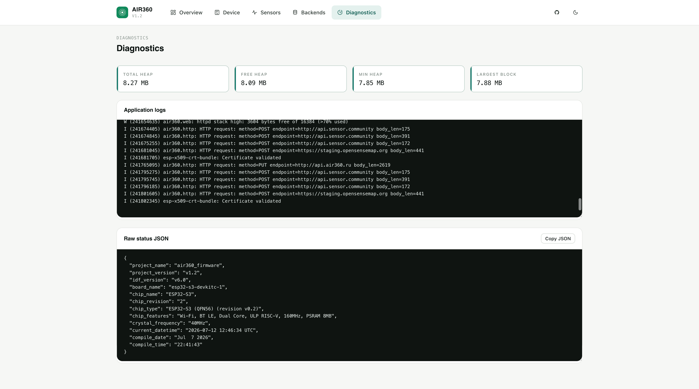

# Air360 Firmware Features — Monitoring & Diagnostics

Once a device is running, two pages tell you how it's doing: **Overview** for
everyday health at a glance, and **Diagnostics** for deeper runtime metrics when
something needs investigating.

---

## Overview page

The Overview page is the main runtime dashboard, refreshed on each load.

### Health pill

A status pill under the page heading summarises overall device health:

| State | Meaning |
|-------|---------|
| Healthy | All checks pass. |
| Starting up | Right after boot, while sensors and SNTP are still warming up. |
| Degraded | A previously healthy check has regressed. |
| Offline | No station uplink past the warmup window. |
| Fault | A hard error in a sensor or backend. |
| Setup | Wi-Fi station credentials are not configured yet. |

### Stats bar

| Field | Description |
|-------|-------------|
| Mode | Current network mode (`station` or `setup AP`). |
| Uplink | Active uplink: `wifi`, `cellular`, `cellular (connecting)`, or `offline`. Cellular is always the primary uplink when enabled. |
| Uptime | Time since last boot. |
| Boot count | Total boots since first flash. |

### Connection block

- **Date** — current UTC date and time (from SNTP once synced; shows
  `1970-01-01` before sync).
- **Wi-Fi** — SSID and current IP address, or `not connected`.
- **Cellular** (only when enabled) — PPP IP address, signal strength in dBm, and
  ping status (`ping ok` / `ping failed`).

### Backend cards

Each enabled backend shows its current state, last upload attempt time, HTTP
status code, and response time.

### Sensor cards

Each configured sensor shows its model and transport binding, poll interval,
runtime state, latest readings, any error message, and the **queued sample
count** — how many collected measurements are currently waiting in the upload
queue. A queue that keeps growing is a signal that uploads aren't succeeding (see
[Troubleshooting](troubleshooting.md)).

---

## Diagnostics page

Open at `http://<device-ip>/diagnostics`. This page surfaces the
troubleshooting-oriented runtime metrics in human-readable form, plus a formatted
raw runtime JSON dump at the bottom with a **Copy JSON** button.

The raw dump includes build info, boot count, reset reason, network state, sensor
runtime state (latest measurements and queued counts), and backend runtime state.
A top-level `diagnostics` object carries heap totals, headroom, largest free
block, task stack high watermarks, and measurement-queue counters; the `cellular`
object carries reconnect attempts, consecutive setup failures,
`pwrkey_cycles_total`, and `last_pwrkey_ms_ago` for modem escalation.

### Memory metrics

The memory stats at the top answer different questions:

| Metric | What it tells you |
|--------|-------------------|
| Total Available | Total 8-bit heap currently available to the allocator. |
| Free Heap | Total free 8-bit heap right now. |
| Min Heap | Lowest free heap value seen since boot. |
| Largest Block | Largest single contiguous block that can be allocated right now. |

- If **Free Heap** is high but **Largest Block** is much smaller, that's
  fragmentation rather than simple low memory.
- With PSRAM enabled and detected, the **8-bit heap** values should be larger
  than the **Internal heap** values. If they're identical, the device is
  effectively running without PSRAM-backed heap.
