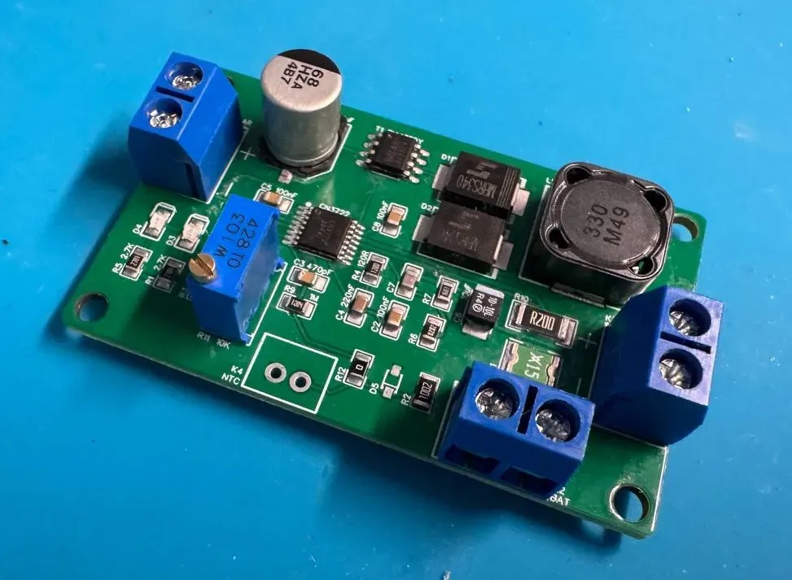

# Air360 Build Guide — Solar Power Module (CN3722)

This guide covers assembling the MPPT solar charger module used to power an
Air360 station off-grid. The board is Malte Pöggel's open **CN3722 MPPT solar
charger** design; this page documents **one specific, tested configuration** —
the one used for the reference Air360 solar setup:

- **Battery: 2S LiFePO4** (two cells in series, 6.4 V nominal, 7.2 V charge voltage)
- **Maximum charge current: 1 A**
- **Temperature sensing: on-board NTC** (no external probe)

If your setup differs — a different battery chemistry, cell count, or charge
current — do not copy this BOM. Read the
[original CN3722 MPPT article](https://www.maltepoeggel.de/?site=solar-mppt-cn3722)
instead: it explains how to recalculate the voltage divider, sense resistor,
inductor, and fuse for your battery, and provides a calculation spreadsheet.

---

## How the module works

The CN3722 is an MPPT (Maximum Power Point Tracking) buck charge controller. It
regulates the solar panel at its most productive operating voltage, charges the
battery with a standard CC/CV profile (constant current until the final voltage
is reached, then constant voltage until the current tapers off), and restarts
charging when the battery voltage drops below a recharge threshold.

The load output is connected through power-path switching: the device runs from
the panel while the sun shines and from the battery at night or on overcast
days, without interruption.

## Why 2S LiFePO4

- **Charge-voltage fit.** Two LiFePO4 cells charge to 7.2 V (3.6 V per cell) —
  comfortably below typical panel voltages, so the buck topology always has
  headroom.
- **Cycle tolerance.** Solar operation means a shallow charge/discharge cycle
  every single day. LiFePO4 handles thousands of such cycles.
- **Safety.** LiFePO4 is far more tolerant of outdoor temperature swings than
  Li-ion, and does not enter thermal runaway under normal fault conditions.
- **Cold-weather protection built in.** LiFePO4 must not be charged below
  freezing; the NTC on this board inhibits charging below about 0 °C.

---

## Bill of materials

This BOM produces the 2S LiFePO4 / 1 A / on-board NTC configuration exactly.
Substitutes are fine for passives as long as value, tolerance, and package
match; the 1 % parts must stay 1 %.

| Ref | Qty | Value / type | Package | Part / note |
|-----|-----|--------------|---------|-------------|
| IC1 | 1 | CN3722 MPPT charge controller | TSSOP-16 | Consonance CN3722 (LCSC C77905) |
| T1 | 1 | P-channel MOSFET | SO-8 | AO4419 |
| L1 | 1 | 33 µH power inductor | 12 × 12 mm | Sumida CDRH125NP-330MC (Isat ≥ 2 A) |
| D1, D2 | 2 | Schottky diode, 3 A / 40 V | SMC (DO-214AB) | MBRS340 |
| D3 | 1 | LED, green (charge complete) | 0805 | Kingbright KP-2012MGC |
| D4 | 1 | LED, red (charging) | 0805 | Kingbright KP-2012SRC |
| F1 | 1 | PTC resettable fuse, 1.1 A / 24 V | 1812 | Littelfuse 1812L110THDR |
| R2 | 1 | NTC 10 kΩ, on-board temperature sense | 0805 | Vishay NTCS0805E3103FMT (LCSC C3195196) |
| R6 | 1 | 82 kΩ, 1 % | 0805 | Panasonic ERJ-6ENF8202V |
| R7 | 1 | 162 kΩ, 1 % | 0805 | Panasonic ERJ-6ENF1623V |
| R10 | 1 | 200 mΩ, 1 % | 2512 | Vishay RCWE2512R200FKEA |
| R11 | 1 | 10 kΩ multiturn trimmer | 64W | Vishay M64W103KB40 |
| R12 | 1 | 0 Ω | 0805 | Selects the on-board NTC (see below) |
| R1, R5 | 2 | 2.7 kΩ, 5 % | 0805 | LED series resistors |
| R3 | 1 | 3.9 kΩ, 5 % | 0805 | |
| R4 | 1 | 120 Ω, 5 % | 0805 | |
| R8 | 1 | 100 kΩ, 5 % | 0805 | |
| R9 | 1 | 1 MΩ, 5 % | 0805 | |
| C1 | 1 | 68 µF / 50 V electrolytic | 8.3 × 8.3 mm | Panasonic EEH-ZA1H680P |
| C6 | 1 | 10 µF / 25 V tantalum | 2412 | AVX TPSC106K025R0300 |
| C7 | 1 | 4.7 pF, C0G/NP0 | 0805 | |
| C3 | 1 | 470 pF, C0G/NP0 | 0805 | |
| C4 | 1 | 220 nF, X7R | 0805 | |
| C2, C5, C8 | 3 | 100 nF, X7R | 0805 | |
| K1, K3 | 2 | 2-pin screw terminal, 5 mm pitch | THT | AKL 101-02 |
| K2 | 1 | JST XH 2-pin | THT, vertical | JST B2B-XH-A |

**Not fitted in this configuration:** D5 and K4 (the external-NTC connector and
its protection diode) — the on-board NTC in position R2 is used instead.

## What sets this configuration apart

These are the components that encode the "2S LiFePO4, 1 A, on-board NTC"
choices. Changing the battery or charge current means changing these — and only
these — parts.

### Charge voltage: R6 = 82 kΩ, R7 = 162 kΩ

R6 and R7 form the feedback divider that sets the final charge voltage —
**7.2 V** for two LiFePO4 cells in series. Lithium chemistries need this voltage
held within ±50 mV, which is why both resistors must be 1 % parts. C7 (4.7 pF)
compensates the divider. For any other battery, recalculate R6/R7 with the
spreadsheet from the original article.

### Charge current: R10 = 200 mΩ

The current-sense resistor sets the maximum charge current to **1 A** — a good
match for the small panels and the modest consumption of an Air360 station.
Three other parts are sized to follow it:

- **L1** — saturation current should be 1.5–2× the charge current; the
  CDRH125NP-330MC (Isat ≥ 2 A) covers 1 A with margin.
- **F1** — the 1.1 A PTC fuse protects the battery rail just above the charge
  current.
- If you raise the charge current per the article's table, resize L1 and F1
  together with R10.

### Temperature sensing: on-board NTC (R2), R12 = 0 Ω

The board supports either an external NTC probe on K4 or an on-board NTC in
position R2. This build uses the **on-board NTC**:

- fit the 10 kΩ NTC at **R2**,
- fit **R12 = 0 Ω** to select it,
- leave **D5 and K4 unpopulated**.

The NTC inhibits charging below roughly 0 °C — essential for LiFePO4, which is
damaged by charging below freezing. The trade-off: the on-board sensor measures
the board's temperature, not the cell's. **Mount the module in the same
enclosure as the battery**, close to the pack, so the reading tracks the cells.
If your battery sits away from the charger, use the external-NTC option from
the original article instead.

---

## Connectors

| Ref | Connector | Function |
|-----|-----------|----------|
| K1 | Screw terminal, 5 mm | Solar panel input |
| K2 | JST XH 2-pin | Battery (2S LiFePO4 pack) — observe polarity |
| K3 | Screw terminal, 5 mm | Load output (power-path switched) |

## LED indicators

- **Red (D4)** — battery has not reached the final voltage yet. It stays on
  even when charging is paused (below the MPP voltage, or NTC temperature
  cutoff).
- **Green (D3)** — battery fully charged.

## Setting the MPP voltage

After assembly, the trimmer **R11** must be adjusted to the panel's maximum
power point voltage (Vmp — printed on the panel label, typically ~18 V for a
"12 V" panel):

1. Connect the battery, then connect a bench power supply in place of the panel,
   set to the panel's Vmp with a current limit below 1 A.
2. Turn R11 until you find the point between a **solid red LED** and **rapid
   flickering of both LEDs** — that transition is the MPP setpoint.
3. Reconnect the actual panel.

## Powering the Air360 from the module

The load output (K3) follows the battery rail — roughly 6.4–7.2 V for this
pack, not 5 V. Add a small 5 V step-down (buck) converter between K3 and the
device's 5 V input (USB-C or the shield's DC barrel jack — see
[Powering the device](assembly.md#powering-the-device)).

A 3D-printable solar panel mount that also houses the module is on Printables:

- [Solar mount on Printables](https://www.printables.com/model/1490965-solar-panel-mount)

---

## Different battery or panel?

Everything on this page assumes the 2S LiFePO4 / 1 A / on-board NTC
configuration. For any other setup — Li-ion, single-cell, lead-acid, higher
charge currents, external temperature probe, or panels above 21 V (the LED
resistors R1/R5 need larger values there) — start from the
[original CN3722 MPPT article](https://www.maltepoeggel.de/?site=solar-mppt-cn3722),
which covers the calculations and component tables for all supported
configurations.

---

*Back to [Hardware Assembly](assembly.md) · Next: [Firmware, Web Interface, and Backends](firmware-and-backends.md).*
