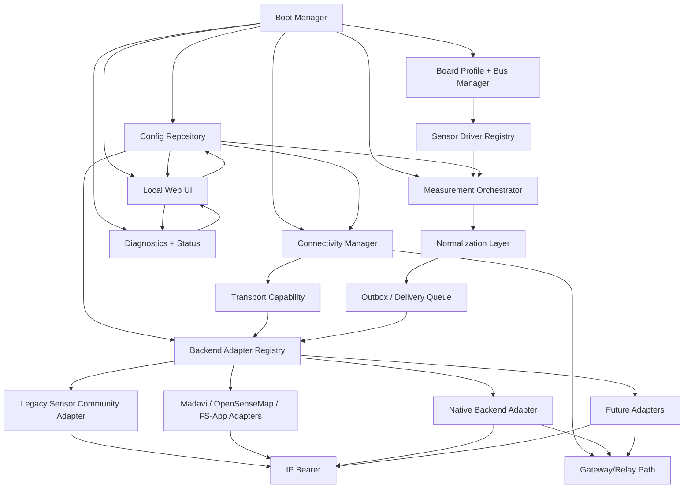

# Modern Replacement Firmware Architecture for `sensor.community`

## Context and Validated Baseline

This proposal treats the current `airrohr-firmware` as a compatibility reference, not as the architectural template.

Validated observations from repository documentation and source:

- The current firmware sends Sensor.Community uploads as one HTTP `POST` per sensor family, with `X-Sensor`, `X-MAC-ID`, `X-PIN`, and a JSON body shaped as `{"software_version": "...", "sensordatavalues":[...]}`.
- Secondary uploads to Madavi, OpenSenseMap, and Feinstaub-App reuse one aggregate JSON envelope per reporting interval.
- Runtime config is persisted in `/config.json` with a backup `/config.json.old`, and the UI saves then reboots.
- The current onboarding flow is a SoftAP on `192.168.4.1` with wildcard DNS and `/config`.
- Documentation and implementation diverge in a few compatibility-relevant areas:
  - `platformio.ini` contains only `DISABLEDenv:` ESP32 environments, so ESP32 is not an actively shipped target in the current build matrix.
  - The UI exposes `static_ip`, `auto_update`, `use_beta`, and `current_lang`, but the ESP32 path does not apply static IP and `twoStageOTAUpdate()` is implemented only for `ESP8266`.
  - The current logger TLS/session path is ESP8266-centric; on ESP32, secure logger handling is incomplete.
  - `esp_mac_id` is initialized in the visible `setup()` path only for ESP8266, while ESP32 uploads still build `X-MAC-ID`.

Those behaviors matter because the replacement should preserve the real backend and migration contract, but should not reproduce accidental ESP32 gaps as if they were intentional design.

# 1. Architecture Goals

## Primary goals

- **Maintainability**
  - Replace a single large firmware image with a small core plus bounded modules.
  - Keep legacy server behavior behind adapters.
  - Use explicit interfaces and versioned schemas.
- **Extensibility**
  - Add sensors by implementing one driver plus registry metadata.
  - Add backends by implementing one uploader adapter plus UI/config exposure.
  - Add connectivity providers without rewriting sampling or upload logic.
- **Backward compatibility**
  - Preserve compatibility-critical HTTP contracts and onboarding flows where migration risk is high.
  - Preserve import of legacy `/config.json` fields where practical.
- **Resource efficiency**
  - Fit practical ESP32-class constraints: RAM pressure, flash wear, limited concurrent sockets, slow radios.
  - Avoid heavyweight dynamic systems or runtime plugin loading.
- **Reliability**
  - Handle absent sensors, partial backend failure, intermittent connectivity, and brownout/reboot conditions.
  - Prefer bounded queues and explicit degraded states over hidden failure loops.
- **Testability**
  - Make sensor drivers, config validation, upload adapters, and connectivity policy testable on host.
  - Separate pure transformation logic from hardware access.
- **Migration safety**
  - Start with a compatible MVP.
  - Keep the native platform model cleaner than the legacy contract.
  - Allow dual-upload during migration.

## Non-goals

- Reproducing the current firmware as a line-by-line rewrite.
- Designing the firmware around Wi-Fi-only assumptions.
- Making legacy payload shapes the internal canonical data model.
- Over-abstracting for hypothetical hardware not on the roadmap.

# 2. Recommended Implementation Language and Platform Stack

## Recommendation

**Primary recommendation: C++17 on ESP-IDF 5.x, built with native ESP-IDF CMake, with PlatformIO optional only as a local convenience wrapper.**

## Why this is the best fit

### Language: C++17

- Best balance for ESP32 firmware today:
  - Low-level hardware access when needed.
  - Mature ESP-IDF support.
  - Easy use of interfaces, RAII, typed models, and static registration.
  - Good interoperability with existing C drivers and vendor SDKs.
- Better than plain C for this project because the architecture needs:
  - driver registries
  - typed config models
  - transport adapters
  - testable serialization and normalization logic
  - bounded object ownership
- Better than Rust for this specific project today because:
  - sensor-driver ecosystem is still much stronger in C/C++ for ESP32 peripherals, modem modules, and hobbyist sensors
  - LoRa, modem, and miscellaneous vendor libraries are more readily available
  - bringing up a broad compatibility platform is faster with ESP-IDF+C++
- Better than Arduino-style C++ as the primary stack because:
  - ESP-IDF gives stronger control over Wi-Fi, PPP/modem, events, HTTP server/client, OTA, NVS, watchdogs, TLS, and tasking
  - the replacement needs explicit connectivity and storage abstractions, not framework-global state

## Framework and tooling choice

### Use

- **ESP-IDF** for the firmware runtime stack
  - `esp_netif`, `esp_event`, `esp_http_server`, `esp_http_client`, `esp-tls`, `esp_ota_ops`, NVS, FreeRTOS, `esp_modem`
- **Native ESP-IDF CMake** as the authoritative build
  - clearer long-term maintenance
  - better alignment with Espressif support
  - easier CI consistency
- **Host-side unit tests** with a normal C++ test framework
  - Catch2, doctest, or GoogleTest

### Acceptable alternative

- **ESP-IDF with Arduino as a component** for selected sensor libraries only, if a specific driver would otherwise delay delivery.
  - This is acceptable as a bridge, not as the architecture center.
  - Arduino compatibility code should stay inside individual drivers or bus wrappers.

### Avoid

- **Pure Arduino-core firmware as the main platform**
  - Too much global-state coupling.
  - Harder modem and PPP integration.
  - Harder to reason about transport state and lifecycle.
  - Encourages monolithic growth.
- **Rust as the first implementation**
  - Technically viable, but a risky multiplier for schedule and integration breadth.
  - Better considered later for selected backend-side components, not the first firmware.

## Implications by concern

| Concern | ESP-IDF + C++17 | Notes |
| --- | --- | --- |
| Modular architecture | Strong | Clear component boundaries and event-driven runtime |
| Sensor integrations | Strong | Can use native drivers and wrap existing C/C++ libraries |
| Cellular modem support | Strong | `esp_modem`, PPP, UART, power control fit naturally |
| LoRa/radio support | Strong | SPI/UART control is straightforward; gateway mode can stay adapter-based |
| OTA | Strong | Native OTA APIs are mature |
| TLS/HTTPS | Strong | Better than the current ESP32 compatibility path |
| Testing | Moderate to strong | Pure modules test well; hardware loops still need integration tests |
| Developer familiarity | Moderate | Harder than Arduino, but justified for this platform |

# 3. Design Principles

- **Composition over monolith**
  - The core orchestrates modules; it does not implement backend- or sensor-specific behavior itself.
- **Legacy compatibility as adapters**
  - Legacy upload schemas, route aliases, and config import live behind compatibility modules.
- **Explicit contracts between modules**
  - Sensors emit normalized readings.
  - Upload adapters consume normalized batches.
  - Connectivity exposes capability, not Wi-Fi internals.
- **Configuration-driven behavior**
  - Enabled sensors, uplink priorities, and backend targets come from validated config.
- **Separation of concerns**
  - Hardware access, business logic, serialization, and UI stay separate.
- **Failure isolation**
  - A broken backend should not break sampling.
  - An absent sensor should not break the rest of the device.
- **Bounded resource use**
  - Prefer static registration, bounded queues, and measured task counts.
- **Progressive enhancement**
  - MVP keeps reboot-on-save if needed.
  - Later versions can add live apply, OTA, richer diagnostics, and alternative uplinks.
- **Storage-agnostic backend contract**
  - Firmware talks to a clean ingestion API, not directly to a chosen TSDB model.

# 4. Proposed High-Level Architecture

## Major subsystems

### Platform core/runtime

- Boot manager
- service registry
- system event bus
- scheduler/task coordination
- health supervisor

### Board and hardware abstraction

- board profiles
- bus manager for I2C, UART, SPI, OneWire, ADC, GPIO
- named connector and pin-role mapping

### Sensor abstraction

- sensor driver registry
- driver lifecycle
- readiness and warm-up state
- capability descriptors

### Measurement orchestration

- schedules reads
- triggers warm-up
- collects results
- builds normalized measurement batches

### Data normalization/model layer

- canonical internal measurement model
- units and metric naming
- metadata separation
- calibration application

### Configuration subsystem

- versioned config schema
- validation
- migration from legacy `/config.json`
- repository abstraction

### Local UI/web configuration subsystem

- onboarding/AP mode
- normal local UI
- route handlers
- config forms and diagnostics views
- compatibility aliases for legacy routes

### Connectivity subsystem

- connectivity manager
- provider registry
- policy for preferred uplinks and failover
- state publication to the rest of the system

### Upload/transport subsystem

- backend registry
- per-backend uploader adapters
- outbox
- retry scheduling
- multi-backend fan-out

### Compatibility layer

- legacy Sensor.Community adapter
- legacy aggregate JSON adapters
- legacy config import
- legacy route aliases and machine-readable endpoints where needed

### Persistence/storage subsystem

- config store
- calibration store
- bounded outbox
- reboot and fault markers

### Diagnostics/logging/status subsystem

- structured local status model
- ring-buffer logs
- per-sensor health
- per-backend delivery status

## Mermaid overview



# 5. Module Breakdown

| Module | Purpose | Responsibilities | Public interface | Depends on | Must not do |
| --- | --- | --- | --- | --- | --- |
| `core/app` | Runtime composition root | boot ordering, lifecycle, service wiring | `App::init()`, `App::run()` | all interface types, not concrete adapters | sensor logic or backend schemas |
| `core/events` | Internal event bus | publish connectivity/config/status events | `publish()`, `subscribe()` | none or RTOS queue | persistent storage or web rendering |
| `boards` | Board profiles and bus topology | map named buses/connectors to pins and power rails | `BoardProfile`, `BoardRegistry` | HAL/bus layer | sensor read logic |
| `hal/bus` | Safe bus access | I2C/UART/SPI/ADC sessions, mutexing, power toggles | `IBusManager`, `IUartPort`, `II2cBus` | ESP-IDF drivers | metric naming or uploads |
| `sensors` | Sensor drivers | probe, init, warm-up, sample, metadata, self-test | `ISensorDriver` | bus interfaces, config, diagnostics | HTTP, config persistence, retry policy |
| `measurements` | Sampling orchestration | schedule sampling, collect readings, emit batches | `IMeasurementOrchestrator` | sensors, time, normalization | endpoint-specific serialization |
| `domain/model` | Canonical data model | normalized metrics, units, metadata structs | data types only | none | hardware or transport access |
| `processing` | Transformations | calibration, derived fields, validity filtering | `CalibrationPipeline`, `Normalizer` | domain model | socket or UI code |
| `config` | Versioned configuration | schema, validation, migration, apply plans | `IConfigRepository`, `IConfigValidator` | storage, domain enums | direct driver calls except via apply actions |
| `webui` | Device UI | routes, HTML/JSON responses, form handling | `WebServerModule` | config, status, onboarding state | direct sensor hardware access |
| `connectivity` | Uplink management | provider lifecycle, state, priorities, failover | `IConnectivityProvider`, `ConnectivityManager` | modem/Wi-Fi/radio adapters | backend request building |
| `uploads` | Delivery fan-out | outbox dequeue, per-backend upload, retries | `IBackendUploader`, `BackendRegistry` | connectivity transport, domain model | raw sensor reads |
| `compatibility` | Legacy preservation | legacy payload builders, route aliases, config import | `LegacyUploadAdapter`, `LegacyConfigImporter` | uploads, config, webui | become the canonical model |
| `storage` | Persistence | config files, outbox segments, calibration blobs | `IStorage`, `IOutboxStore` | ESP-IDF FS/NVS | business rules |
| `diagnostics` | Troubleshooting surface | logs, health snapshots, counters, last errors | `IStatusProvider`, `ILogSink` | events, storage | config mutation except reset actions |

# 6. Runtime Flow

## Boot sequence

1. Early boot initializes logging, reset-reason capture, watchdog, and storage.
2. Board profile is selected at build time or by detected hardware variant.
3. Config repository loads the active config.
4. If config is invalid, migrate if possible; otherwise enter safe setup mode with defaults.
5. Bus manager initializes shared buses and power rails.
6. Sensor registry builds configured sensor instances from the board profile and config.
7. Connectivity manager initializes providers listed in config, but does not block the whole boot on one provider.
8. Local web UI starts early in either onboarding mode or normal mode.
9. Measurement orchestrator starts periodic schedules.
10. Delivery manager starts consuming normalized batches from the outbox when a suitable uplink is available.

## Hardware initialization

- Board profile provides:
  - bus map
  - optional sensor power switches
  - modem power/reset lines if present
  - LoRa radio SPI pins if present
- Drivers are initialized lazily where possible.
- Drivers with long warm-up times register a warm-up plan instead of blocking boot.

## Sensor discovery and registration

- No blind auto-probing across every possible driver by default.
- Use configured sensor instances plus controlled probing for allowed buses.
- A sensor instance reaches one of these states:
  - `configured`
  - `present`
  - `absent`
  - `degraded`
  - `failed_init`

## Config loading

- Load versioned config.
- Run schema validation.
- Run migration transforms from older config versions or legacy flat keys.
- Produce an immutable `ResolvedConfig` used by runtime modules.

## Connectivity initialization

- Initialize configured providers in priority order.
- Providers publish capabilities:
  - `ip_bearer`
  - `dns`
  - `tls`
  - `gateway_relay`
  - `metered`
  - `low_bandwidth`

## Wi-Fi initialization

- If Wi-Fi station credentials are configured, try station mode first.
- If unavailable and onboarding is allowed, start AP mode and local config UI.
- When connected, advertise local UI via mDNS if enabled.

## Modem initialization

- Power on modem via board profile hooks.
- Start UART/PPP session through a modem adapter.
- Wait for network attach within bounded timeout.
- Publish `ip_bearer` only after data session is ready.

## Radio/LoRa initialization

- Initialize the radio provider only if configured.
- Radio provider may expose:
  - `gateway_relay` capability only
  - not `ip_bearer`
- Legacy HTTP adapters therefore do not use it directly.

## UI/config mode availability

- If device is unconfigured or connectivity setup failed, onboarding UI is available immediately.
- In normal mode, the local UI remains available for diagnostics and configuration.
- Compatibility routes may remain enabled in both modes.

## Scheduler/task model

Recommended runtime task split:

- `control_task`
  - config apply, state transitions, safe restarts
- `measurement_task`
  - sampling schedule, sensor warm-up, batch creation
- `delivery_task`
  - outbox handling, retries, backend fan-out
- `connectivity_task`
  - provider lifecycle and reconnection policy
- `web server task`
  - provided by `esp_http_server`

## Measurement collection

- Scheduler triggers sensor actions by declared timing class:
  - immediate read
  - warm-up then read
  - continuous sensor poll
  - externally clocked / interrupt-assisted
- Read results are normalized into the internal model.

## Data normalization

- Convert driver-specific output into canonical metrics and units.
- Attach sensor instance ID, quality, and optional calibration provenance.
- Keep backend-specific naming out of the normalized model.

## Upload pipeline

1. Normalized batch is written to the outbox.
2. Delivery manager asks connectivity manager for the best available path.
3. Backend registry returns enabled backends that are compatible with that path.
4. Each backend adapter serializes the batch into its target schema.
5. Delivery status is tracked per backend, not globally.

## Failure and retry behavior

- Sensor read failure affects only that sensor instance.
- Backend failure schedules per-backend retry with backoff.
- Connectivity loss pauses affected transports and preserves unsent data within outbox limits.
- If one backend fails and another succeeds, successful backend state advances independently.

## Status updates

- Runtime publishes status snapshots for:
  - sensors
  - connectivity providers
  - backends
  - last sample and last successful upload

## End-to-end flow: normal Wi-Fi-based operation

1. Device boots and loads config.
2. Wi-Fi station connects.
3. Sensor drivers initialize and report present/absent.
4. Measurement task schedules reads every configured interval.
5. Normalized batch enters outbox.
6. Delivery manager fan-outs to:
  - legacy Sensor.Community adapter
  - Madavi adapter
  - native backend adapter
7. Per-backend results are recorded.
8. `/status` and native diagnostics endpoints show current health.

## End-to-end flow: first-time setup / onboarding

1. No valid network config exists.
2. AP onboarding mode starts on `192.168.4.1`.
3. Wildcard DNS and `/config` compatibility route are enabled.
4. User submits network, device, sensor, and backend configuration.
5. Config is validated and written.
6. MVP behavior: save and reboot.
7. Device rejoins using configured uplink and begins reporting.

## End-to-end flow: configuration update by user

1. User opens local UI in normal mode.
2. UI fetches current config snapshot and status.
3. User updates backends or sensor settings.
4. Config subsystem validates and produces an apply plan.
5. Safe changes may apply live later; MVP can still reboot after save.
6. Modules restart only as required in later phases.

## End-to-end flow: upload failure scenario

1. Measurement batch is created.
2. Connectivity is present, but Sensor.Community responds `5xx`.
3. Backend adapter marks attempt failed and retryable.
4. Outbox retains the batch for that backend within retention limits.
5. Other enabled backends may still receive the same batch.

## End-to-end flow: partial backend failure in multi-backend mode

1. Madavi succeeds.
2. OpenSenseMap fails due to auth or endpoint error.
3. Native backend succeeds.
4. Delivery manager records:
  - batch delivered to Madavi
  - batch delivered to native backend
  - OpenSenseMap pending or failed based on retry policy
5. UI shows backend-specific health, not a single upload status bit.

## End-to-end flow: connectivity fallback / alternative uplink

1. Preferred Wi-Fi provider is down.
2. Cellular provider is configured as secondary and becomes available.
3. Connectivity manager advertises `ip_bearer` via cellular.
4. Legacy HTTP adapters and native HTTP adapter continue to function.
5. If neither IP bearer is available but a LoRa relay path exists:
  - only adapters supporting `gateway_relay` may send
  - legacy direct HTTP backends remain paused
  - native relay-capable backend can still forward compact envelopes to a gateway

# 7. Sensor Extension Architecture

## Design goals

- Add a new sensor without touching upload code.
- Keep driver logic isolated from board pin definitions.
- Support mixed buses and mixed timing models.
- Make missing or partially failing sensors first-class states.

## Sensor driver model

Each driver declares:

- driver type and supported models
- required bus type
- metrics it can produce
- warm-up behavior
- optional metadata and calibration support
- supported board connector classes

## Sensor driver interface

```cpp
enum class SensorState {
    Configured,
    Present,
    Absent,
    Degraded,
    FailedInit
};

struct MetricDescriptor {
    const char* key;          // canonical metric key, e.g. "pm10"
    const char* unit;         // e.g. "ug/m3"
    bool numeric;
};

struct WarmupProfile {
    uint32_t cold_start_ms;
    uint32_t settle_ms;
    bool continuous_mode_preferred;
};

struct SensorCapabilities {
    const char* driver_key;
    BusType bus_type;
    Span<const MetricDescriptor> metrics;
    WarmupProfile warmup;
    bool supports_calibration;
    bool supports_self_test;
};

struct SampleResult {
    SensorState state;
    Vector<MeasurementValue> values;
    Vector<DiagnosticEvent> diagnostics;
};

class ISensorDriver {
public:
    virtual ~ISensorDriver() = default;
    virtual SensorCapabilities capabilities() const = 0;
    virtual InitResult init(const SensorInitContext& ctx) = 0;
    virtual SensorState state() const = 0;
    virtual NextAction next_action(Timestamp now) const = 0;
    virtual SampleResult sample(const SampleContext& ctx) = 0;
    virtual void apply_calibration(const CalibrationProfile& profile) = 0;
};
```

## Capability declaration

Capabilities should cover:

- bus/protocol: I2C, UART, SPI, OneWire, ADC
- metric list and units
- required sample cadence
- required warm-up
- optional self-test
- optional metadata fields such as serial number or firmware revision

## Initialization lifecycle

1. Construct from config and board binding.
2. Acquire bus handle from bus manager.
3. Probe if allowed.
4. Move to `Present`, `Absent`, or `FailedInit`.
5. Register timing requirements with measurement orchestrator.

## Measurement interface

- Drivers return structured results, not preformatted JSON strings.
- Drivers must not know Sensor.Community `value_type` names.
- Drivers report:
  - values
  - timestamp origin
  - sensor health
  - optional diagnostics

## Units and normalization

- Canonical internal units must be explicit.
- Use stable metric keys such as:
  - `pm1`
  - `pm2_5`
  - `pm10`
  - `temperature`
  - `humidity`
  - `pressure`
  - `co2`
- Backend adapters translate canonical keys to legacy names where necessary.

## Metadata and calibration

Optional metadata per sensor instance:

- hardware model
- bus address or port alias
- serial number if available
- calibration revision
- warm-up mode

Calibration support should allow:

- offset/slope transforms
- sensor-specific correction curves
- externally managed calibration profiles

## Missing or unavailable sensors

- Missing sensors remain registered but report `Absent`.
- UI shows configured-but-absent clearly.
- Upload adapters may omit missing metrics rather than sending sentinel values.

## Warm-up and timing classes

The orchestrator should classify sensors into timing modes:

| Mode | Examples | Handling |
| --- | --- | --- |
| Immediate read | simple digital environmental sensors | sample on schedule |
| Warm-up then read | optical PM sensors needing fan/laser stabilization | start warm-up before batch deadline |
| Continuous read | sensors best left running | poll latest stable value |
| Long-settle / low-rate | gas sensors, CO2 | independent slower schedule |

## Grouping by bus/protocol

- Drivers bind to abstract bus handles, not global pins.
- Bus manager owns:
  - mutexing
  - bus speed
  - error counters
  - optional bus recovery

## Board pin/config mapping strategy

- Board profiles define named attachment points:
  - `pm_uart_main`
  - `env_i2c`
  - `aux_i2c`
  - `gps_uart`
  - `modem_uart`
  - `lora_spi`
- Config selects sensor instances against named attachment points, not raw GPIO numbers by default.
- Advanced manual pin override can exist later, but should not be the main path.

## Adding a new sensor

The normal path to add a sensor should be:

1. Implement one `ISensorDriver`.
2. Register it in the sensor registry.
3. Add config/UI metadata for enabling and binding it.
4. Add compatibility mapping only if a legacy backend needs special field names.

No changes should be required in:

- measurement orchestrator
- connectivity subsystem
- outbox
- native backend contract

# 8. Connectivity Architecture

## Core model

Connectivity must be represented as providers with capabilities, not as direct use of Wi-Fi APIs from the rest of the codebase.

## Connectivity provider abstraction

```cpp
enum class ConnectivityCapability {
    IpBearer,
    Dns,
    Tls,
    GatewayRelay,
    Metered,
    LowBandwidth
};

enum class ConnectivityState {
    Down,
    Starting,
    Connecting,
    Ready,
    Degraded,
    Failed
};

class IConnectivityProvider {
public:
    virtual ~IConnectivityProvider() = default;
    virtual const char* key() const = 0;
    virtual ConnectivityState state() const = 0;
    virtual CapabilitySet capabilities() const = 0;
    virtual Result start(const ProviderConfig&) = 0;
    virtual void stop() = 0;
    virtual bool can_carry(TransportRequirement req) const = 0;
    virtual NetworkHandle network_handle() = 0;
};
```

## Providers

### Wi-Fi provider

- station mode
- AP onboarding mode
- DHCP/static IP
- TLS-capable IP bearer

### Cellular modem provider

- modem-agnostic interface over UART/USB/PPP
- SIM7670G should be one modem adapter, not the connectivity architecture itself
- modem adapter handles:
  - power sequencing
  - AT setup
  - network registration
  - APN config
  - PPP session
- connectivity provider above it exposes generic `IpBearer`

### LoRa / radio provider

- should not pretend to be a direct HTTP transport
- usually exposes `GatewayRelay`, not `IpBearer`
- can send:
  - compact native ingestion envelopes
  - relay frames for a gateway service

## Direct IP uplink vs indirect gateway/relay uplink

- **Direct IP uplink**
  - Wi-Fi and cellular
  - supports legacy HTTP adapters and native HTTP ingestion
- **Indirect gateway/relay uplink**
  - LoRa or mesh-style radio
  - should target a relay/gateway ingestion service, not legacy HTTP endpoints directly

## Connectivity state exposure

The rest of the firmware should consume:

- current active provider
- list of available providers
- capabilities
- metered/unmetered hint
- last failure reason

It must not call provider-specific APIs directly.

## Retry and reconnect ownership

- Provider owns link establishment and reconnect behavior.
- Delivery manager owns upload retry behavior.
- Backend adapters own request serialization only.

This separation is important:

- do not let backend upload code trigger Wi-Fi reconnects
- do not let modem code make backend retry decisions

## Connection priority and failover policy

Recommended policy model:

- ordered provider preference list
- optional per-backend override
- metered policy
  - e.g. allow native backend on cellular
  - disable large or secondary uploads on metered links
- degraded policy
  - e.g. legacy secondary uploads paused on cellular or relay

## Configuration of preferred/available uplinks

Config should express:

- enabled providers
- priority order
- credentials per provider
- metered flags
- allowed backends per provider class

## What upload adapters may assume

Upload adapters may assume:

- they receive a transport capability matching their declared requirement
- they can open a request through a generic transport factory

Upload adapters may not assume:

- Wi-Fi is the active bearer
- DNS always exists
- payload size is unconstrained
- direct IP is always available

# 9. Backend / Upload Extension Architecture

## Core recommendation

Use a normalized internal batch model plus a registry of backend adapters. Each backend adapter owns only:

- schema mapping
- request building
- endpoint-specific auth/headers
- backend-specific response interpretation

Everything else stays outside the adapter.

## Internal normalized measurement model

```cpp
struct MeasurementValue {
    std::string metric_key;      // canonical, e.g. "pm10"
    double value;
    std::string unit;            // e.g. "ug/m3"
    std::string sensor_instance; // e.g. "pm.main"
    QualityCode quality;
    std::optional<Timestamp> observed_at;
};

struct MeasurementBatch {
    std::string batch_id;
    uint64_t sequence;
    Timestamp observed_at;
    uint32_t sample_period_ms;
    std::vector<MeasurementValue> values;
    DeviceContext device;
    RuntimeContext runtime;
};
```

## Backend adapter interface

```cpp
enum class DeliveryMode {
    DirectHttp,
    GatewayRelay
};

struct BackendCapabilities {
    const char* backend_key;
    DeliveryMode mode;
    bool supports_batch;
    bool supports_partial_retry;
};

class IBackendUploader {
public:
    virtual ~IBackendUploader() = default;
    virtual BackendCapabilities capabilities() const = 0;
    virtual bool is_enabled(const BackendConfig&) const = 0;
    virtual TransportRequirement requirement(const BackendConfig&) const = 0;
    virtual UploadRequest build_request(const MeasurementBatch&, const BackendConfig&) = 0;
    virtual UploadResult handle_response(const TransportResponse&) = 0;
};
```

## Backend registry / registration model

- Compile-time registration with static tables or factory functions.
- No runtime code loading.
- Registry maps backend key to:
  - uploader factory
  - config schema fragment
  - UI metadata

## Concrete adapters

- `legacy_sensor_community`
- `legacy_madavi`
- `legacy_opensensemap`
- `legacy_feinstaub_app`
- `native_ingestion_http`
- later:
  - `native_ingestion_relay`
  - `mqtt_bridge`
  - `webhook_generic`

## Request building responsibility

Backend adapter owns:

- URL path
- headers
- auth
- serialization to JSON/form/text
- response code interpretation

Core upload subsystem owns:

- scheduling
- queueing
- retry windows
- provider selection
- attempt accounting

## Serialization ownership

- Legacy schemas are serialized in compatibility adapters.
- Native schema is serialized in the native adapter.
- Core never contains backend-specific field names like `sensordatavalues`.

## Retry policy ownership

- Global delivery manager owns retry timing and backoff.
- Backend adapter may return hints:
  - retryable
  - permanent failure
  - auth failure
  - throttled

## Endpoint and config ownership

- Backend config contains endpoint/auth details where backend requires them.
- Fixed legacy defaults remain in adapter defaults, not in the core.

## Multi-backend behavior

- A batch can target multiple enabled backends simultaneously.
- Delivery state is tracked per backend.
- One backend failing must not cancel others.

## Partial failure handling

Recommended outbox model:

- Each batch has one record.
- Each enabled backend has a delivery cursor or per-batch status bitset.
- Batch is removable only after:
  - all required backends succeeded, or
  - batch aged out, or
  - failed backends were marked permanent or disabled

## Isolation of backend-specific schemas

- Legacy field maps live under `compatibility/legacy_uploads`.
- Native schema lives under `uploads/native`.
- Domain model remains canonical and stable.

## Adding a new backend later

The intended cost should be:

1. Implement one new `IBackendUploader`.
2. Register it in the backend registry.
3. Add its config schema and UI form section.
4. Add tests for request-building and response handling.

It should not require changes in:

- sensor drivers
- measurement orchestrator
- connectivity providers
- core runtime

# 10. New Backend API Contract Proposal

## Concise API design rationale

The new native API should be:

- compact enough for ESP32 over intermittent links
- explicit enough for long-term schema evolution
- storage-agnostic on the backend
- friendly to both direct IP and gateway/relay submission
- easy to map into time-series storage

The API should therefore use:

- HTTPS + JSON
- batch-oriented ingestion
- explicit device identity
- canonical metric keys and units
- numeric values as numbers, not strings
- stable schema versioning at the URL and body level

## Recommended protocol

- `HTTPS`
- `POST /api/v1/ingest/measurements`

## Authentication

Recommended first version:

- `Authorization: Bearer <device_token>`

Why:

- easy on firmware
- easy to rotate
- independent from MAC addresses
- works across Wi-Fi, cellular, and gateway relays

## Device identity model

Use two identifiers:

- `device_id`
  - stable logical ID assigned at provisioning or first registration
- `hardware_uid`
  - immutable hardware-derived identifier or hashed hardware identifier

Optional legacy aliases:

- `legacy_sensor_id`
- `legacy_chip_id`

Do not make raw MAC address the public primary key.

## Measurement payload model

Top-level request structure:

```text
{
  "schema_version": "1.0",
  "message_id": "string",
  "device": { ... },
  "batch": {
    "sequence": number,
    "observed_at": "RFC3339 UTC",
    "sample_period_ms": number,
    "measurements": [ ... ],
    "diagnostics": [ ... ]
  }
}
```

## Metadata model

Separate metadata from measurements:

- device metadata in `device`
- optional sensor metadata in `device.sensors`
- runtime diagnostics in `batch.diagnostics`

Do not encode metadata as pseudo-metrics.

## Timestamp strategy

- Batch-level `observed_at` is required.
- Per-measurement `observed_at` is optional for asynchronous or mixed-timing sensors.
- All timestamps use RFC3339 UTC.

## Batch vs single-event submission

- Firmware should use batch submission by default.
- A single measurement batch with one item is still valid.
- This keeps one contract for both simple and rich devices.

## Error response model

```json
{
  "error": {
    "code": "invalid_payload",
    "message": "measurement unit is missing",
    "retryable": false,
    "details": [
      {
        "field": "batch.measurements[1].unit",
        "issue": "required"
      }
    ]
  }
}
```

## Idempotency

Use `message_id` plus `device_id` for idempotent upsert semantics.

Recommended firmware rule:

- `message_id = <device_id>:<sequence>:<observed_at>`

## Versioning strategy

- URL version: `/api/v1/...`
- Body `schema_version`: `"1.0"`
- Backward-compatible additive fields allowed within v1
- Breaking changes require `/api/v2/...`

## Schema-like request body

```text
schema_version: string, required
message_id: string, required
device: object, required
  device_id: string, required
  hardware_uid: string, required
  legacy_sensor_id: string, optional
  board: string, optional
  firmware: object, required
    name: string, required
    version: string, required
    compatibility_mode: string, optional
  connectivity: object, optional
    active_provider: string
    metered: boolean
  sensors: array<object>, optional
    sensor_instance: string, required
    driver: string, required
    model: string, optional
    bus: string, optional
batch: object, required
  sequence: integer, required
  observed_at: string RFC3339 UTC, required
  sample_period_ms: integer, required
  measurements: array<object>, required
    metric: string, required
    value: number, required
    unit: string, required
    sensor_instance: string, required
    quality: string, optional
    observed_at: string RFC3339 UTC, optional
  diagnostics: array<object>, optional
```

## Minimal JSON example

```json
{
  "schema_version": "1.0",
  "message_id": "sc-esp32-6f12ab34:4182:2026-03-21T09:18:00Z",
  "device": {
    "device_id": "sc-esp32-6f12ab34",
    "hardware_uid": "hw-a1b2c3d4e5f6",
    "firmware": {
      "name": "scfw",
      "version": "0.1.0"
    }
  },
  "batch": {
    "sequence": 4182,
    "observed_at": "2026-03-21T09:18:00Z",
    "sample_period_ms": 145000,
    "measurements": [
      {
        "metric": "pm10",
        "value": 12.34,
        "unit": "ug/m3",
        "sensor_instance": "pm.main"
      }
    ]
  }
}
```

## Richer JSON example

```json
{
  "schema_version": "1.0",
  "message_id": "sc-esp32-6f12ab34:4183:2026-03-21T09:20:25Z",
  "device": {
    "device_id": "sc-esp32-6f12ab34",
    "hardware_uid": "hw-a1b2c3d4e5f6",
    "legacy_sensor_id": "esp8266-12345678",
    "board": "sc-esp32-main-v1",
    "firmware": {
      "name": "scfw",
      "version": "0.1.0",
      "compatibility_mode": "legacy-upload-enabled"
    },
    "connectivity": {
      "active_provider": "wifi",
      "metered": false
    },
    "sensors": [
      {
        "sensor_instance": "pm.main",
        "driver": "sds011",
        "model": "SDS011",
        "bus": "uart"
      },
      {
        "sensor_instance": "env.main",
        "driver": "bme280",
        "model": "BME280",
        "bus": "i2c"
      }
    ]
  },
  "batch": {
    "sequence": 4183,
    "observed_at": "2026-03-21T09:20:25Z",
    "sample_period_ms": 145000,
    "measurements": [
      {
        "metric": "pm1",
        "value": 7.8,
        "unit": "ug/m3",
        "sensor_instance": "pm.main",
        "quality": "ok"
      },
      {
        "metric": "pm2_5",
        "value": 9.2,
        "unit": "ug/m3",
        "sensor_instance": "pm.main",
        "quality": "ok"
      },
      {
        "metric": "pm10",
        "value": 12.34,
        "unit": "ug/m3",
        "sensor_instance": "pm.main",
        "quality": "ok"
      },
      {
        "metric": "temperature",
        "value": 21.5,
        "unit": "celsius",
        "sensor_instance": "env.main",
        "quality": "ok"
      },
      {
        "metric": "humidity",
        "value": 48.2,
        "unit": "percent",
        "sensor_instance": "env.main",
        "quality": "ok"
      }
    ],
    "diagnostics": [
      {
        "code": "wifi_rssi_dbm",
        "value": -67
      },
      {
        "code": "sample_count",
        "value": 580
      }
    ]
  }
}
```

## Why this is better than the legacy contract

- Numeric values stay numeric.
- Device metadata is explicit instead of being smuggled through headers or pseudo-fields.
- One canonical schema can support multiple sensors cleanly.
- Legacy field names like `SDS_P1` are no longer the core domain model.
- Idempotency and versioning are defined explicitly.
- The contract works with both direct ingestion and relay/gateway forwarding.

# 11. Backend Storage / Time-Series Strategy

## Is Prometheus a good fit?

### Good fit for

- backend/service health
- fleet operational metrics
- ingest pipeline monitoring
- short-to-medium retention of aggregated operational signals

### Poor fit for as the primary historical sensor store

- very large per-device cardinality if every device/metric/sensor instance becomes a time series label set
- awkward handling of mutable device metadata
- not ideal for raw event ingestion semantics from intermittently connected devices
- limited fit for long-term archive, map views, data export, and per-device history browsing
- pull-oriented mental model mismatches device push ingestion

## Prometheus-compatible ingestion usefulness

- Useful indirectly, not as the main firmware contract.
- A backend service may expose Prometheus metrics about:
  - ingest rate
  - failed uploads
  - online devices
  - backend latency
- Firmware itself may optionally expose local `/metrics` for diagnostics compatibility.

## Recommended primary store

**Primary recommendation: PostgreSQL + TimescaleDB, optionally with PostGIS for location-aware device metadata and map views.**

Why:

- SQL is useful for mixed metadata + measurements.
- Hypertables and continuous aggregates fit periodic sensor readings well.
- Retention and downsampling are first-class.
- Easier than Prometheus for historical queries and product-oriented APIs.
- Easier than pure ClickHouse for operational simplicity at moderate scale.

## Acceptable large-scale evolution path

- If ingest volume grows far beyond comfortable PostgreSQL/TimescaleDB bounds, move cold analytics or high-volume aggregates to ClickHouse.
- Keep the firmware-facing API unchanged.

## API-to-storage mapping

Recommended logical backend model:

- `devices`
  - current device identity and static metadata
- `device_metadata_history`
  - mutable metadata changes over time
- `sensor_instances`
  - per-device sensor definitions
- `measurement_points`
  - time-series values with columns such as:
    - `observed_at`
    - `device_id`
    - `sensor_instance`
    - `metric`
    - `value`
    - `unit`
    - `quality`
- `device_diagnostics`
  - operational values like RSSI, battery, queue depth, upload failures

## Cardinality considerations

Keep high-cardinality metadata out of TSDB labels when possible.

Good tags/dimensions:

- `device_id`
- `sensor_instance`
- `metric`
- `project`

Avoid as labels on every point unless necessary:

- firmware version history
- coordinates
- modem operator
- full board metadata

## Retention and downsampling

Recommended pattern:

- raw points: 3 to 12 months
- 5-minute aggregates: multi-year
- hourly or daily aggregates: long-term

## Dashboards and map views

- Charts should query downsampled aggregates for longer time windows.
- Map views should pull current or recent device state from a materialized latest-state table, not compute it from raw points every time.

## Storage recommendation summary

- Prometheus: useful for backend observability, not primary historical sensor storage.
- TimescaleDB: recommended primary historical store.
- Native firmware API: storage-agnostic event/batch ingestion.

# 12. Compatibility Layer Strategy

## Preserve exactly

- Sensor.Community upload shape:
  - `POST /v1/push-sensor-data/`
  - `X-Sensor`
  - `X-MAC-ID`
  - `X-PIN`
  - `software_version`
  - `sensordatavalues`
  - string values in legacy JSON
- Aggregate JSON compatibility for:
  - Madavi
  - OpenSenseMap
  - Feinstaub-App
- Onboarding compatibility where migration benefit is high:
  - AP mode
  - `192.168.4.1`
  - `/config`
  - captive-portal aliases

## Preserve behaviorally, not internally

- Save-and-restart semantics for config changes in MVP
- import/export of legacy config keys
- machine-readable endpoints like `/data.json` and `/metrics` if users or tools depend on them

## Modernize safely

- internal config schema
- sensor runtime model
- secure transport handling
- OTA implementation
- diagnostics model
- backend fan-out and retry logic

## What should not leak into the new architecture

- legacy field names as canonical metric names
- one-file monolithic firmware structure
- Wi-Fi-specific assumptions in upload code
- ESP8266-era quirks being preserved as design requirements for ESP32

## Compatibility scope by area

| Area | Strategy |
| --- | --- |
| API compatibility | implement dedicated legacy upload adapters |
| configuration compatibility | provide importer for current flat `/config.json` keys |
| user-flow compatibility | preserve AP onboarding and `/config` alias route |
| identifiers | preserve legacy device ID/header generation where needed, but use native `device_id` internally |

# 13. Configuration Architecture

## Config model structure

Recommended top-level schema:

```text
config_version
device
board
sensors[]
connectivity
backends[]
ui
system
compatibility
```

## Section responsibilities

- `device`
  - device name, location, identity aliases
- `board`
  - board profile, connector bindings, optional power control
- `sensors[]`
  - enabled instances, binding, calibration, schedule overrides
- `connectivity`
  - provider list, credentials, priority, metered policy
- `backends[]`
  - enabled targets, auth, endpoint overrides, provider restrictions
- `ui`
  - onboarding settings, auth, route exposure
- `system`
  - sampling interval, logs, OTA channel, diagnostics settings
- `compatibility`
  - enable legacy routes, config import mode, legacy ID behavior

## Storage boundaries

- Versioned config document in LittleFS for structured config and import/export.
- Optional NVS namespace for secrets later.
- Outbox and runtime markers stored separately from config.

## Validation rules

- schema validation
- semantic validation
  - no duplicate sensor instance IDs
  - required provider credentials present
  - backend requirements compatible with configured providers
  - board bindings valid for chosen board profile

## Defaults

- minimal defaults should lead to safe onboarding mode
- no hard-coded production secret defaults
- legacy upload defaults enabled only in migration profiles, not universally

## Versioning and migration

- integer `config_version`
- migration functions `v1 -> v2 -> v3`
- dedicated legacy importer from current `airrohr` flat keys

## Per-backend configuration model

Each backend entry should include:

- `backend_key`
- `enabled`
- `auth`
- `endpoint_override`
- `provider_policy`
- `retry_policy_override` if needed

## Safe update/apply behavior

- validate first
- write temp file
- atomically switch active config
- produce apply plan

Apply classes:

- live-safe
  - backend auth/token changes
  - diagnostics verbosity
- module-restart-safe
  - connectivity credentials
  - backend list changes
- reboot-required in MVP
  - board-level pin changes
  - deep sensor topology changes

# 14. Local UI / Device Configuration Architecture

## Onboarding mode vs normal mode

- **Onboarding mode**
  - AP enabled
  - captive portal behavior
  - simplified setup pages
- **Normal mode**
  - station or other primary uplink active
  - full diagnostics and config surface

## AP mode / local UI assumptions

- Preserve `192.168.4.1` in compatibility mode.
- Preserve `/config`, `/generate_204`, and `/fwlink` aliases when compatibility mode is enabled.
- Use server-rendered pages with light JS; do not ship a large SPA for MVP.

## Route organization

Recommended native route groups:

- `/`
  - status home
- `/setup`
  - onboarding wizard
- `/config/network`
- `/config/sensors`
- `/config/backends`
- `/config/system`
- `/status`
- `/diagnostics`
- `/api/v1/device/config`
- `/api/v1/device/status`

Compatibility aliases:

- `/config`
- `/values`
- `/status`
- `/data.json`
- `/metrics`

## Relationship to config subsystem

- UI never writes storage directly.
- UI submits config changes to the config service.
- Config service validates and returns either:
  - accepted with apply plan
  - rejected with field errors

## Validation/submission flow

1. Render current config snapshot and status.
2. User submits changes.
3. Server validates schema and semantics.
4. UI receives:
  - success and apply action
  - or field-level errors

## Apply/save/reboot behavior

- MVP can preserve save-and-reboot for most changes.
- Later versions should apply backend changes and some connectivity changes live.

## Status and diagnostics surface

- sensor presence and last sample age
- backend health per adapter
- connectivity state per provider
- queue depth and last upload results
- firmware version and reset reason

## Backend configuration management in UI

- each backend section should come from registry metadata
- new backend forms should not require hand-editing the whole UI architecture

## Connectivity mode management in UI

- provider list
- priority order
- credentials
- metered policy
- failover enable/disable

## Future extensibility

The UI should have placeholders for:

- OTA
- export/import config
- calibration editing
- modem diagnostics
- relay diagnostics

# 15. Persistence and State Management

## Persisted state

- active config
- previous config backup
- calibration profiles
- backend credentials/tokens
- bounded outbox
- last known device identity and sequence counter
- reset/fault markers

## Runtime-only state

- current connectivity state
- current sensor state
- current sample in progress
- transient backoff timers
- current AP session state

## Storage abstraction

Use interfaces such as:

- `IConfigStore`
- `ISecretStore`
- `IOutboxStore`
- `ICalibrationStore`

## Avoid tight coupling

- Core code must not know whether config came from LittleFS or NVS.
- Upload code must not know how the outbox is implemented.

## Corruption, reset, and upgrades

- maintain backup of last good config
- validate on load
- if corrupt:
  - try backup
  - then safe defaults + onboarding mode
- record corruption event in diagnostics

# 16. Reliability and Failure Handling

## Sensor read failures

- record per-sensor error counters
- omit invalid values from upload batch
- keep driver state visible in UI

## Absent sensors

- configured-but-absent is valid
- do not block boot forever trying to initialize one missing sensor

## Network failures

- connectivity providers reconnect independently
- uploads back off independently
- preserve unsent batches within outbox capacity

## Modem failures

- modem provider owns power cycle and reattach policy
- hard failure should not crash the whole application

## Radio/LoRa failures

- relay path degrades independently
- if relay unavailable, native relay backend pauses and reports degraded state

## Backend-specific upload failures

- per-backend retry and error accounting
- distinguish:
  - retryable
  - auth/config error
  - payload/schema error
  - endpoint unavailable

## Partial backend failures

- one failing backend must not block successful ones
- UI should show backend-specific status, not only last global upload result

## Config corruption and invalid input

- validation before activation
- backup rollback on failure
- field-level UI errors for invalid input

## Boot loops after bad config

- safe-mode counter in RTC/NVS
- if repeated crashes after config apply:
  - boot with previous config
  - or force onboarding mode

## Watchdog and restart

- use task watchdogs for critical loops
- avoid watchdog masking by long blocking sensor calls
- restart only on unrecoverable conditions

## Degraded mode behavior

Examples:

- sensors degraded but UI and config remain available
- Wi-Fi down but AP diagnostics can still be offered if configured
- native backend disabled on metered cellular while legacy primary remains enabled

# 17. Testability Strategy

## Unit-testable modules

- config schema and migration
- metric normalization
- legacy payload builders
- native payload serializer
- retry policy and failover policy
- backend response classification

## Mockable interfaces

- sensor drivers
- bus manager
- connectivity providers
- transport factory
- storage

## Sensor simulation

- fake sensor drivers generating deterministic readings
- time-controlled warm-up behavior
- absent/degraded sensor scenarios

## Backend adapter tests

- request headers
- body shape
- path construction
- response handling
- legacy contract golden tests

## Connectivity provider tests

- provider priority rules
- failover selection
- metered-policy filtering

## Config validation tests

- legacy config import
- invalid binding detection
- reboot-required apply classification

## UI handler tests

- route responses for config submission
- field validation behavior
- compatibility alias routing

## Integration boundaries

- hardware-in-the-loop tests for:
  - Wi-Fi onboarding
  - one PM sensor + one environmental sensor
  - legacy upload
  - native upload
  - modem PPP bring-up later

# 18. Observability and Diagnostics

## Practical diagnostics model

- local status page
- JSON diagnostics endpoint
- ring-buffer logs
- counters and last-error surfaces

## Local status reporting

Expose:

- firmware version and uptime
- board profile
- active connectivity provider
- queue depth
- last sample time
- last successful upload per backend

## Logs and debug levels

- structured severity levels
- short ring buffer kept in RAM
- optional persisted crash summary

## Sensor health visibility

- state
- last sample age
- init errors
- read error count

## Upload health visibility per backend

- enabled/disabled
- last attempt
- last success
- failure reason
- retry backoff remaining

## Connectivity health visibility

- provider state
- signal quality where applicable
- modem registration and PDP/PPP state later
- relay/gateway reachability later

## Config visibility

- current active config version
- whether config was migrated/imported
- last apply action and restart reason

## Troubleshooting support

- export redacted diagnostics snapshot
- expose compatibility-mode status clearly
- show whether native and legacy backends are both active

# 19. Suggested Project Structure

```text
firmware-next/
  CMakeLists.txt
  main/
    app_main.cpp
  components/
    core/
      app/
      events/
      scheduler/
      time/
    domain/
      model/
      units/
    boards/
      profiles/
      registry/
    hal/
      bus/
      gpio/
      power/
    sensors/
      common/
      drivers/
        sds011/
        sps30/
        bme280/
        scd30/
        ds18b20/
      registry/
    measurements/
      orchestrator/
      normalization/
      calibration/
    connectivity/
      manager/
      providers/
        wifi/
        cellular/
        lora_relay/
      modem/
        sim7670g/
      transport/
    uploads/
      registry/
      common/
      native/
      legacy/
        sensor_community/
        madavi/
        opensensemap/
        feinstaub_app/
    config/
      schema/
      validation/
      migration/
      repository/
      legacy_import/
    webui/
      routes/
      pages/
      assets/
      api/
      compatibility/
    storage/
      littlefs/
      nvs/
      outbox/
    diagnostics/
      status/
      logging/
      crash/
  test/
    unit/
    integration/
    golden/
      legacy_payloads/
  tools/
    payload-fixtures/
    config-migration/
```

# 20. Recommended Interfaces and Contracts

## Sensor driver interface

```cpp
class ISensorDriver {
public:
    virtual SensorCapabilities capabilities() const = 0;
    virtual InitResult init(const SensorInitContext&) = 0;
    virtual SensorState state() const = 0;
    virtual NextAction next_action(Timestamp now) const = 0;
    virtual SampleResult sample(const SampleContext&) = 0;
};
```

## Measurement provider interface

```cpp
class IMeasurementProvider {
public:
    virtual Result<MeasurementBatch> collect_batch(Timestamp now) = 0;
};
```

## Connectivity provider interface

```cpp
class IConnectivityProvider {
public:
    virtual const char* key() const = 0;
    virtual ConnectivityState state() const = 0;
    virtual CapabilitySet capabilities() const = 0;
    virtual bool can_carry(TransportRequirement) const = 0;
    virtual NetworkHandle network_handle() = 0;
};
```

## Backend uploader interface

```cpp
class IBackendUploader {
public:
    virtual BackendCapabilities capabilities() const = 0;
    virtual TransportRequirement requirement(const BackendConfig&) const = 0;
    virtual UploadRequest build_request(const MeasurementBatch&, const BackendConfig&) = 0;
    virtual UploadResult handle_response(const TransportResponse&) = 0;
};
```

## Backend registry interface

```cpp
class IBackendRegistry {
public:
    virtual Span<const BackendDescriptor> descriptors() const = 0;
    virtual IBackendUploader& get(std::string_view backend_key) = 0;
};
```

## Config repository interface

```cpp
class IConfigRepository {
public:
    virtual Result<ResolvedConfig> load() = 0;
    virtual Result<ValidatedConfig> validate(const PendingConfig&) = 0;
    virtual Result<ApplyPlan> save_and_plan(const ValidatedConfig&) = 0;
};
```

## Storage interface

```cpp
class IOutboxStore {
public:
    virtual Result<void> append(const MeasurementBatch&) = 0;
    virtual Result<Span<QueuedBatch>> peek_ready(size_t limit) = 0;
    virtual Result<void> mark_backend_result(BatchId, BackendKey, UploadResult) = 0;
    virtual Result<void> gc() = 0;
};
```

## Status provider interface

```cpp
class IStatusProvider {
public:
    virtual DeviceStatusSnapshot snapshot() const = 0;
};
```

# 21. Incremental Migration / Delivery Plan

## Phase 1: architecture skeleton and stack decision

### Goals

- lock stack: ESP-IDF + C++17
- create module skeleton and interfaces
- define canonical measurement model and config schema

### Deliverables

- repository layout
- build system
- empty registries and interface contracts
- golden fixtures for legacy payloads

### Risks

- over-design before first hardware proof

### Postpone

- modem implementation
- relay implementation
- complex live config apply

## Phase 2: minimal device boot + config + one sensor + Wi-Fi

### Goals

- prove boot flow, config load/save, AP onboarding, and one real sensor

### Deliverables

- board profile for one ESP32 target
- Wi-Fi provider
- local UI with `/config` compatibility alias
- one PM or environmental sensor driver

### Risks

- UI scope creep
- board abstraction becoming too generic too early

### Postpone

- multi-backend
- OTA
- persistent outbox beyond minimal implementation

## Phase 3: legacy-compatible upload MVP

### Goals

- preserve the most critical existing ecosystem contract

### Deliverables

- Sensor.Community legacy adapter
- exact header/body compatibility tests
- `/data.json` and `/metrics` compatibility endpoints if needed

### Risks

- subtle header or field-name mismatches

### Postpone

- secondary legacy backends
- relay delivery

## Phase 4: modular sensor expansion

### Goals

- prove the sensor extension architecture

### Deliverables

- 3 to 5 representative drivers across UART and I2C
- absent/degraded sensor handling
- sensor metadata in native model

### Risks

- timing complexity with warm-up sensors

### Postpone

- obscure long-tail sensors

## Phase 5: multi-backend support

### Goals

- support real migration and fan-out use cases

### Deliverables

- Madavi, OpenSenseMap, Feinstaub-App adapters
- backend registry
- per-backend status and retries

### Risks

- backend-specific quirks leaking into the core

### Postpone

- generic webhook framework

## Phase 6: new native backend contract implementation

### Goals

- establish clean long-term API

### Deliverables

- native ingestion adapter
- backend-side test fixtures
- dual-upload mode

### Risks

- premature schema churn

### Postpone

- binary or CBOR optimization unless needed

## Phase 7: connectivity expansion for modem and/or LoRa strategy

### Goals

- prove connectivity abstraction with a second and third uplink mode

### Deliverables

- cellular provider using modem adapter
- relay-capable native backend path for LoRa/gateway delivery

### Risks

- trying to make legacy HTTP work directly over LoRa

### Postpone

- mesh routing in firmware
- complex roaming policies

## Phase 8: advanced UI / diagnostics / OTA

### Goals

- finish operational polish

### Deliverables

- richer diagnostics
- config import/export
- OTA
- partial live apply

### Risks

- UI scope dominating firmware work

### Postpone

- nonessential cosmetic UI work

# 22. Key Risks and Trade-Offs

| Risk / Trade-off | Recommendation |
| --- | --- |
| Compatibility vs modernization | keep compatibility only at adapter boundaries |
| Flexibility vs firmware complexity | use compile-time registries and a small number of interfaces |
| Dynamic configuration vs code size | support versioned config, but not arbitrary runtime plugin loading |
| Multi-backend support vs reliability | use per-backend status and a bounded outbox |
| Generic sensor model vs sensor richness | keep canonical metrics simple, allow optional metadata extensions |
| ESP-IDF power vs Arduino simplicity | choose ESP-IDF anyway; the architecture needs it |
| Modem/LoRa extensibility vs MVP scope | prepare interfaces now, defer implementation |
| Prometheus simplicity vs product needs | do not use Prometheus as the primary historical store |

# 23. Recommended MVP Scope

## Smallest realistic MVP

- one ESP32 board profile
- Wi-Fi station + AP onboarding
- local config UI with `/config` compatibility alias
- LittleFS config store with legacy config import
- 1 PM sensor driver and 1 environmental sensor driver
- normalized measurement model
- Sensor.Community legacy adapter
- native backend adapter
- dual-upload support to legacy + native backend
- basic `/status`, `/data.json`, and `/metrics` equivalents

## Why this is enough

- proves the architecture is viable
- preserves the most important ecosystem contract
- is usable on real hardware
- enables backend migration immediately

## Explicitly postpone from MVP

- modem implementation
- LoRa relay implementation
- OTA
- live module reconfiguration without reboot
- full long-tail sensor catalog

## But prepare architecturally now

- `IConnectivityProvider`
- transport capability model
- backend adapter registry
- outbox with per-backend state

# 24. Final Recommendation

Build an ESP32-first replacement on **ESP-IDF + C++17** with a **small orchestration core**, **board-aware sensor drivers**, a **connectivity manager**, and a **backend adapter registry**. Keep the current `sensor.community` contract, current onboarding flow, and selected local endpoints from day one, but implement them as compatibility modules.

What to build first:

- the canonical measurement model
- config repository and legacy importer
- Wi-Fi onboarding and local UI
- one sensor driver path
- the Sensor.Community legacy uploader
- the native ingestion uploader

What to isolate immediately:

- legacy payload schemas
- connectivity providers
- sensor drivers
- config migration logic

What not to over-engineer:

- runtime plugin loading
- live reconfiguration in the first release
- binary wire formats before JSON proves insufficient

What to keep compatible from day one:

- Sensor.Community HTTP contract
- AP onboarding with `/config`
- compatibility import of current config keys

Which native backend contract to adopt first:

- `POST /api/v1/ingest/measurements`
- HTTPS
- bearer token auth
- batch-oriented JSON
- explicit `device`, `batch`, and numeric `measurements`

## Recommended Native Ingestion Contract

```json
{
  "schema_version": "1.0",
  "message_id": "sc-esp32-6f12ab34:4182:2026-03-21T09:18:00Z",
  "device": {
    "device_id": "sc-esp32-6f12ab34",
    "hardware_uid": "hw-a1b2c3d4e5f6",
    "firmware": {
      "name": "scfw",
      "version": "0.1.0"
    }
  },
  "batch": {
    "sequence": 4182,
    "observed_at": "2026-03-21T09:18:00Z",
    "sample_period_ms": 145000,
    "measurements": [
      {
        "metric": "pm10",
        "value": 12.34,
        "unit": "ug/m3",
        "sensor_instance": "pm.main"
      }
    ]
  }
}
```

## Time-Series Storage Decision

- **Prometheus should be used indirectly, not as the primary storage for historical sensor data.**
- **TimescaleDB on PostgreSQL should be the primary store for historical sensor measurements and chart queries.**
- **Prometheus-compatible metrics should be used for backend and fleet observability, not as the canonical measurement archive.**
